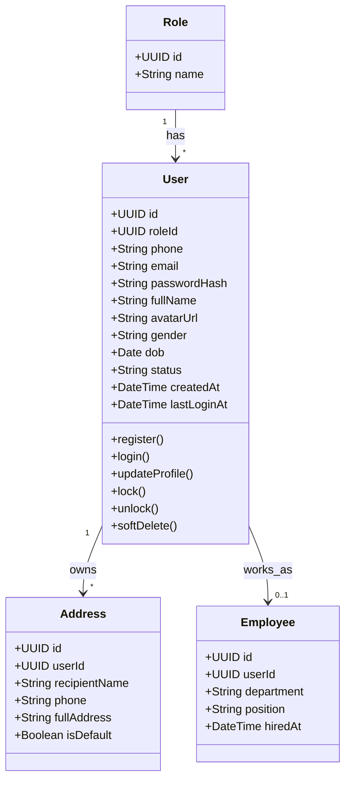
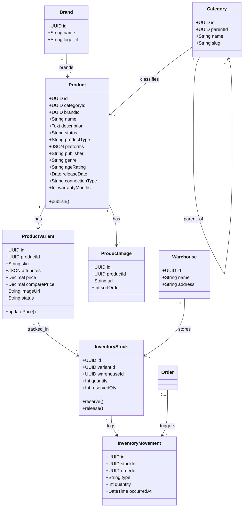
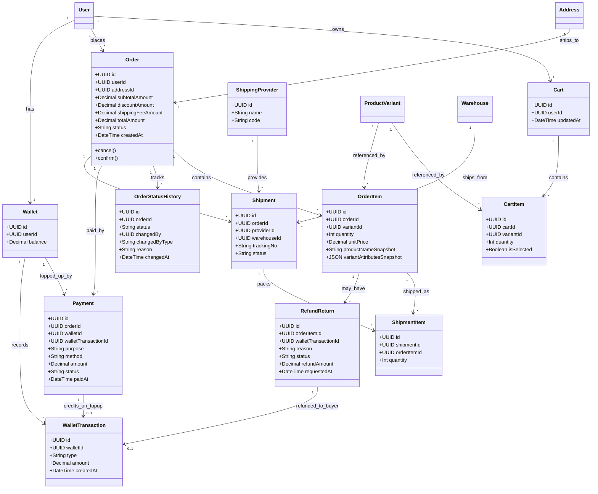
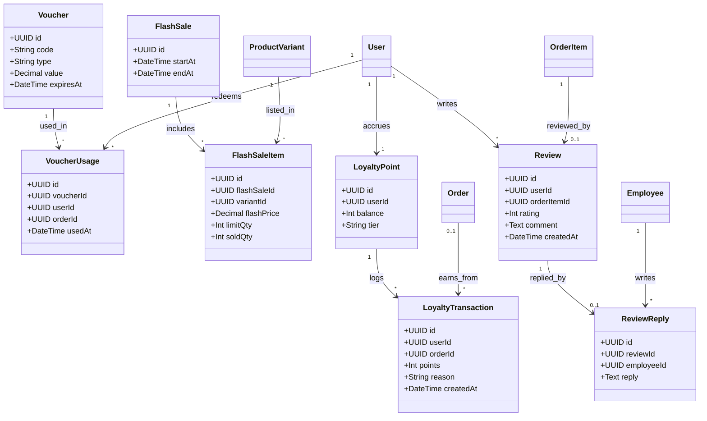
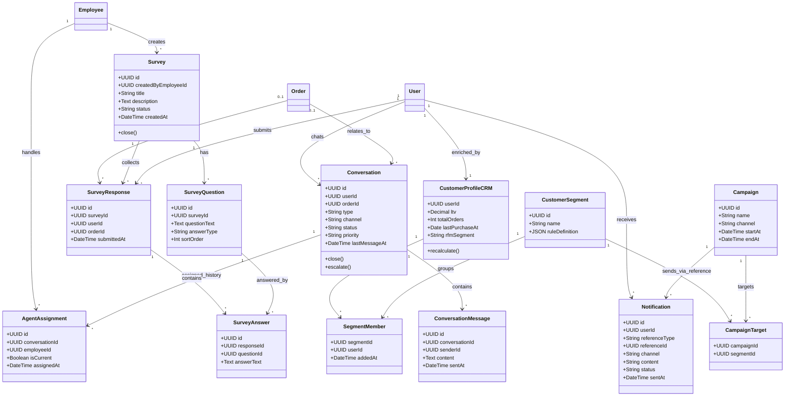

# Class Diagram — Hệ thống CRM + Bán lẻ trực tuyến (1 doanh nghiệp)

> **v9**: Chốt ngành hàng kinh doanh cụ thể — công ty bán lẻ **tay cầm chơi game (controller) và đĩa game**. Thêm vào `Product`: `productType` (`game_disc`/`controller`/`accessory`), `platforms` (JSON — nền tảng tương thích: PS5, PS4, Xbox Series X, Nintendo Switch, PC...), `publisher`, `genre`, `ageRating` (PEGI/ESRB, chỉ dùng cho `game_disc`), `releaseDate`, `connectionType` (`wired`/`wireless`/`bluetooth`, chỉ dùng cho `controller`/`accessory`), `warrantyMonths` (chỉ dùng cho hàng phần cứng). Các field chỉ áp dụng cho 1 loại sản phẩm để NULL ở loại còn lại — không tách bảng con riêng cho từng `productType` vì danh mục chỉ có 2-3 loại sản phẩm, tách bảng sẽ là over-engineering.
> **v8**: Gọn hoá schema từ 51 → 45 bảng bằng cách gộp/bỏ các bảng dư thừa hoặc không gắn với yêu cầu chấm điểm nào: gộp `UserProfile` vào `User`, bỏ `ShipmentTracking` (giữ `Shipment.status`), gộp `SupportTicket`/`TicketMessage` vào `Conversation`/`ConversationMessage` (thêm `type`/`orderId`/`status`/`priority`/`channel`), gộp `FeedbackSurvey` vào `Survey`/`SurveyResponse` (thêm `orderId`), bỏ hẳn `InteractionLog`. Các bảng audit-trail thật sự có giá trị (`OrderStatusHistory`, `InventoryMovement`) được giữ nguyên.
> **v7**: Bổ sung `Survey`/`SurveyQuestion`/`SurveyResponse`/`SurveyAnswer` (khảo sát thật, nhiều câu hỏi) và làm rõ `User.status` hỗ trợ khóa/xóa mềm tài khoản khách hàng — đáp ứng đầy đủ các tính năng quản lý khách hàng của CRM (thêm/khóa/xóa mềm khách hàng, tạo-gửi-thống kê khảo sát), vốn là core feature cho cả 2 mục đích dùng chung nền tảng này.
> **v6**: Chuyển từ mô hình **marketplace đa gian hàng** (nhiều Shop độc lập, mỗi Shop tự đăng ký/được duyệt, tự có ví/hoa hồng) sang mô hình **1 doanh nghiệp bán lẻ duy nhất** — toàn bộ Product/Warehouse/Order thuộc thẳng về công ty, không còn khái niệm "Shop" là một bên thứ ba. Nhân sự nội bộ (bán hàng, kho, admin, CSKH) được gom vào 1 entity `Employee`. Lý do đổi: dùng chung nền tảng này cho một đồ án khác yêu cầu hệ thống thông tin cho **một** doanh nghiệp thương mại, không phải sàn TMĐT nhiều người bán.
> Diagram được chia theo 5 domain để dễ đọc: (A) Identity & Company, (B) Catalog & Inventory, (C) Order & Transaction, (D) Marketing & Loyalty, (E) CRM & Customer Care.

---

## 0. Sơ đồ tổng quát (Overview — gộp cả 5 domain)

> Chỉ giữ tên class + quan hệ chính (bỏ thuộc tính/method) để nhìn toàn cảnh kiến trúc và cách 5 domain kết nối với nhau qua các entity dùng chung (`User`, `Product`/`ProductVariant`, `Order`).

```mermaid
classDiagram
    %% ===== A. Identity & Company =====
    class User
    class Address
    class Role
    class Employee

    %% ===== B. Catalog & Inventory =====
    class Brand
    class Category
    class Product
    class ProductVariant
    class ProductImage
    class Warehouse
    class InventoryStock
    class InventoryMovement

    %% ===== C. Cart -> Order -> Payment -> Shipping =====
    class Cart
    class CartItem
    class Order
    class OrderItem
    class OrderStatusHistory
    class Payment
    class Wallet
    class WalletTransaction
    class ShippingProvider
    class Shipment
    class ShipmentItem
    class RefundReturn

    %% ===== D. Marketing & Loyalty =====
    class Voucher
    class VoucherUsage
    class FlashSale
    class FlashSaleItem
    class LoyaltyPoint
    class LoyaltyTransaction
    class Review
    class ReviewReply

    %% ===== E. CRM & Customer Care =====
    class CustomerProfileCRM
    class CustomerSegment
    class SegmentMember
    class Campaign
    class CampaignTarget
    class AgentAssignment
    class Conversation
    class ConversationMessage
    class Notification
    class Survey
    class SurveyQuestion
    class SurveyResponse
    class SurveyAnswer

    %% --- A: Identity & Company ---
    User --> Address
    Role --> User
    User --> Employee

    %% --- B: Catalog & Inventory ---
    Brand --> Product
    Category --> Category
    Category --> Product
    Product --> ProductVariant
    Product --> ProductImage
    ProductVariant --> InventoryStock
    Warehouse --> InventoryStock
    InventoryStock --> InventoryMovement
    Order --> InventoryMovement

    %% --- C: Cart/Order/Payment/Shipping ---
    User --> Cart
    Cart --> CartItem
    ProductVariant --> CartItem
    User --> Order
    Address --> Order
    Order --> OrderItem
    ProductVariant --> OrderItem
    Order --> OrderStatusHistory
    Order --> Payment
    Wallet --> Payment
    Payment --> WalletTransaction
    Order --> Shipment
    ShippingProvider --> Shipment
    Warehouse --> Shipment
    Shipment --> ShipmentItem
    OrderItem --> ShipmentItem
    OrderItem --> RefundReturn
    RefundReturn --> WalletTransaction
    User --> Wallet
    Wallet --> WalletTransaction

    %% --- D: Marketing & Loyalty ---
    Voucher --> VoucherUsage
    User --> VoucherUsage
    FlashSale --> FlashSaleItem
    ProductVariant --> FlashSaleItem
    User --> LoyaltyPoint
    LoyaltyPoint --> LoyaltyTransaction
    Order --> LoyaltyTransaction
    User --> Review
    OrderItem --> Review
    Review --> ReviewReply
    Employee --> ReviewReply

    %% --- E: CRM & Customer Care ---
    User --> CustomerProfileCRM
    CustomerProfileCRM --> SegmentMember
    CustomerSegment --> SegmentMember
    CustomerSegment --> CampaignTarget
    Campaign --> CampaignTarget
    Employee --> AgentAssignment
    Conversation --> AgentAssignment
    User --> Conversation
    Order --> Conversation
    Conversation --> ConversationMessage
    Order --> SurveyResponse
    User --> Notification
    Campaign --> Notification
    Employee --> Survey
    Survey --> SurveyQuestion
    Survey --> SurveyResponse
    User --> SurveyResponse
    SurveyResponse --> SurveyAnswer
    SurveyQuestion --> SurveyAnswer
```

**Cách đọc nhanh:**
- `User` và `Product`/`ProductVariant`/`Order` là các "trục" chia sẻ dữ liệu giữa các domain — không còn trục `Shop` vì chỉ có 1 doanh nghiệp.
- Domain **A (Identity & Company)** là gốc: mọi domain khác đều phụ thuộc vào `User`; nhân sự nội bộ chỉ là `User` có thêm hồ sơ `Employee`.
- Domain **B (Catalog)** thuộc thẳng về doanh nghiệp (không qua trung gian Shop nào), là nguồn cho C, D qua `ProductVariant`.
- Domain **C (Order flow)** giờ đơn giản hơn nhiều: 1 lần đặt hàng = 1 `Order` duy nhất (không tách theo nhiều Shop), không còn ví/hoa hồng cho bên thứ ba.
- Domain **D (Marketing)** và **E (CRM)** đứng "trên cùng", không có domain nào phụ thuộc ngược vào D/E.

---

## A. Identity & Company

> Thay đổi so với v5: bỏ hẳn `Shop`, `ShopVerification`, `ShopStaff` — không còn khái niệm đăng ký/duyệt một "bên bán" độc lập. Nhân sự nội bộ (bán hàng, kho, quản trị, CSKH) gom vào 1 entity `Employee` gắn với `User`, phân biệt nhau qua `department`.
>
> **v7**: làm rõ ngữ nghĩa `User.status` để đáp ứng yêu cầu "quản lý khách hàng" của CRM — nhận 1 trong các giá trị `active` / `locked` (admin khóa tài khoản, đăng nhập bị chặn) / `deleted` (**xóa mềm** — admin "xóa" khách hàng nhưng bản ghi và toàn bộ lịch sử đơn hàng/giao dịch liên quan vẫn giữ nguyên trong DB, chỉ ẩn khỏi danh sách khách hàng và chặn đăng nhập). Thêm method `lock()`/`unlock()`/`softDelete()` trên `User`.

`Employee.department` là enum nghiệp vụ: `sales` (bán hàng), `warehouse` (kho), `admin` (quản trị hệ thống), `cs` (chăm sóc khách hàng) — dùng để phân tách giao diện quản trị theo từng bộ phận (đúng yêu cầu "giao diện Admin phải tách biệt với giao diện quản lý kho/bán hàng").

---

## B. Catalog & Inventory (có ProductVariant)

> Thay đổi so với v5: `Product` và `Warehouse` không còn `shopId` — toàn bộ catalog và kho thuộc thẳng về doanh nghiệp, không qua trung gian Shop.

---

## C. Cart → Order → Payment → Shipping

> Thay đổi so với v5:
> - **Bỏ `Checkout`**: vì chỉ có 1 doanh nghiệp, không cần tách 1 lần thanh toán thành nhiều Order theo nhiều Shop nữa — **1 lần đặt hàng = 1 `Order` duy nhất**. `addressId` chuyển thẳng vào `Order`.
> - **Bỏ `ShopWallet`/`ShopWalletTransaction`/`Payout`/`commissionAmount`**: không còn hoa hồng cho bên thứ ba — tiền bán hàng là doanh thu nội bộ của chính doanh nghiệp, không cần mô hình hoá dòng tiền trả cho "shop" nào cả.
> - `Payment` giờ gắn thẳng vào `Order` (thay vì `Checkout`), vẫn giữ nhánh `walletId`/`purpose` cho nạp ví.
> - `RefundReturn` chỉ còn nối `WalletTransaction` (hoàn tiền cho buyer), bỏ nhánh `ShopWalletTransaction`.

---

## D. Marketing & Loyalty

> Thay đổi so với v5: `Voucher` và `FlashSale` bỏ `shopId`/`scope` — chỉ còn ở cấp công ty (không còn phân biệt platform-wide/shop-wide vì chỉ có 1 doanh nghiệp). `ReviewReply` gắn `employeeId` (nhân viên CSKH trả lời) thay vì `shopId`.

---

## E. CRM & Customer Care

> Thay đổi so với v5: bỏ entity `Agent` riêng — nhân viên CSKH giờ là `Employee` với `department = "cs"` (tránh trùng lặp với entity mới ở domain A). `Conversation` bỏ `shopId` vì khách chỉ chat với duy nhất 1 doanh nghiệp, không cần phân biệt "chat với shop nào".
>
> **v7**: thêm `Survey`/`SurveyQuestion`/`SurveyResponse`/`SurveyAnswer` — khảo sát thật có nhiều câu hỏi tùy chỉnh do `Employee` tạo, gửi tới khách hàng (qua `Campaign`/`Notification` đã có sẵn, `Notification.referenceType = "survey"`), khách trả lời từng câu. Khác với `FeedbackSurvey` (chỉ 1 điểm NPS gắn cứng theo 1 `Order` cụ thể) — `Survey` là công cụ khảo sát chung (vd: thăm dò trước khi ra mắt sản phẩm mới), không gắn với đơn hàng nào, cả hai cùng tồn tại vì phục vụ mục đích khác nhau.

---

## Ghi chú thay đổi (v5 → v6, chuyển sang mô hình 1 doanh nghiệp duy nhất)

- **Bỏ `Shop`, `ShopVerification`, `ShopStaff`**: không còn khái niệm bên bán thứ ba tự đăng ký/được duyệt. Toàn bộ `Product`, `Warehouse` giờ thuộc thẳng về doanh nghiệp (bỏ `shopId` khỏi cả hai).
- **Thêm `Employee`** (thay `ShopStaff`): gắn với `User`, có `department` (`sales`/`warehouse`/`admin`/`cs`) — vừa đại diện nhân sự nội bộ, vừa là cơ sở để tách giao diện quản trị theo bộ phận.
- **Bỏ `Checkout`**: 1 lần đặt hàng giờ luôn ra đúng 1 `Order` (trước đây `Checkout` cần thiết để tách 1 giỏ hàng đa-shop thành nhiều Order — không còn cần vì chỉ có 1 doanh nghiệp). `Payment` và `Address` gắn thẳng vào `Order`.
- **Bỏ `ShopWallet`, `ShopWalletTransaction`, `Payout`, field `commissionAmount` trên `Order`**: không còn hoa hồng/rút tiền cho bên thứ ba. `RefundReturn` chỉ còn hoàn tiền cho buyer qua `WalletTransaction`.
- **`Voucher`/`FlashSale` bỏ `shopId`/`scope`**: chỉ còn ở cấp công ty, không cần phân biệt platform-wide/shop-wide nữa.
- **`ReviewReply.shopId` → `employeeId`**: nhân viên CSKH (một `Employee`) là người trả lời đánh giá, không phải "shop" trả lời.
- **Bỏ entity `Agent` riêng, dùng `Employee` (department = "cs")**: tránh trùng lặp giữa "nhân viên nội bộ nói chung" và "nhân viên CSKH" — cả hai giờ là cùng 1 khái niệm `Employee`, chỉ khác `department`.
- **`Conversation` bỏ `shopId`**: khách chỉ chat với duy nhất 1 doanh nghiệp nên không cần định danh "chat với shop nào".

## Ghi chú thay đổi (v6 → v7, bổ sung tính năng CRM còn thiếu)

Lý do: rà soát lại yêu cầu môn Hệ thống thông tin doanh nghiệp (mục CRM) phát hiện các tính năng quản lý khách hàng cốt lõi của CRM chưa được mô hình hoá đầy đủ — đây cũng là tính năng lõi cần cho chính đồ án CNPM (domain E vốn đã đặt tên "CRM & Customer Care" từ đầu), không phải chỉ để đáp ứng riêng môn HTTTDN.

- **Thêm `Survey`, `SurveyQuestion`, `SurveyResponse`, `SurveyAnswer`**: khảo sát thật có nhiều câu hỏi tùy chỉnh, do `Employee` tạo, gửi tới khách hàng (tái dùng `Campaign`/`Notification` đã có — `Notification.referenceType = "survey"` — không cần thêm quan hệ mới giữa `Campaign` và `Survey`), khách trả lời từng câu qua `SurveyAnswer`. Đáp ứng đúng yêu cầu "tạo bảng khảo sát, gửi đến khách hàng, thống kê kết quả" — điều mà `FeedbackSurvey` (chỉ 1 điểm NPS gắn cứng theo `Order`) không làm được.
- **Làm rõ `User.status`** (`active`/`locked`/`deleted`) + thêm method `lock()`/`unlock()`/`softDelete()`: đáp ứng "khóa tài khoản khách hàng" và "xóa khách hàng" — chọn **xóa mềm** (đổi `status` sang `deleted`, giữ nguyên toàn bộ bản ghi + lịch sử đơn hàng/giao dịch liên quan trong DB) thay vì xóa cứng, đúng thực hành chuẩn (xóa cứng sẽ phá vỡ tính toàn vẹn tham chiếu của `Order`/`Payment`/`Review`... đã trỏ tới `userId` đó).
- **Không thêm entity mới cho "báo cáo tỷ lệ độ tuổi, sở thích khách hàng"**: đây là báo cáo tổng hợp (aggregate), tính trực tiếp từ dữ liệu đã có sẵn — độ tuổi từ `UserProfile.dob`, sở thích/ngành hàng ưa chuộng suy ra từ lịch sử `Order`→`OrderItem`→`Product`→`Category`. Không cần lưu thêm trường "sở thích" riêng vì dữ liệu hành vi mua hàng đã đủ để tính.
- **Không thêm API "admin thêm khách hàng mới" như một entity/quan hệ mới**: tái dùng thẳng `User` (domain A) — chỉ là một cách tạo `User` khác (do admin tạo thay vì khách tự đăng ký), không đổi cấu trúc dữ liệu.

## Ghi chú thay đổi (v8 → v9, chốt ngành hàng: tay cầm chơi game & đĩa game)

Lý do: chốt lại đây là hệ thống cho một công ty bán lẻ cụ thể — chuyên **tay cầm chơi game (controller)** và **đĩa game**, không phải bán lẻ đa ngành hàng chung chung. Thêm field đặc thù ngành vào `Product` thay vì tách bảng con `GameDisc`/`Controller` riêng, vì:
- Danh mục chỉ có 2-3 `productType` (`game_disc`, `controller`, `accessory`), số field đặc thù mỗi loại ít (4-5 field) — tách bảng riêng sẽ phải JOIN thêm ở mọi truy vấn catalog mà không có lợi ích rõ ràng.
- Các field không dùng đến ở `productType` khác chỉ đơn giản để `NULL`.

Field mới trên `Product`:
- **`productType`** (`game_disc`/`controller`/`accessory`): phân biệt loại sản phẩm để biết field nào áp dụng.
- **`platforms`** (JSON, mảng chuỗi — vd `["PS5","PS4"]`): nền tảng tương thích. Dùng JSON thay vì bảng M-N riêng vì đây là thuộc tính hiển thị/lọc, không cần truy vấn quan hệ phức tạp; dùng chung được cho cả đĩa game (thường 1 platform) và tay cầm (thường nhiều platform).
- **`publisher`**, **`genre`**, **`ageRating`** (PEGI/ESRB): chỉ áp dụng cho `game_disc` — thông tin bắt buộc phải hiển thị khi bán đĩa game.
- **`releaseDate`**: ngày phát hành, áp dụng cho cả 2 loại (game mới ra mắt / tay cầm đời mới).
- **`connectionType`** (`wired`/`wireless`/`bluetooth`): chỉ áp dụng cho `controller`/`accessory`.
- **`warrantyMonths`**: số tháng bảo hành, chỉ áp dụng cho hàng phần cứng (`controller`/`accessory`) — đĩa game không có khái niệm bảo hành.

## Ghi chú thay đổi (v7 → v8, gọn hoá schema 51 → 45 bảng)

Lý do: rà soát lại toàn bộ 51 bảng sau khi viết migration thật, phát hiện một số bảng dư thừa (tách 1-1 không cần thiết, hoặc trùng chức năng với bảng khác) hoặc không gắn với bất kỳ yêu cầu chấm điểm nào của cả 2 môn. Giữ nguyên các bảng audit-trail thật sự có giá trị (`OrderStatusHistory`, `InventoryMovement`) vì có gắn với yêu cầu cụ thể (lịch sử trạng thái đơn hàng, biến động tồn kho).

- **Gộp `UserProfile` vào `User`**: `fullName`, `avatarUrl`, `gender`, `dob` chuyển thẳng thành field của `User`. Đây là quan hệ 1-1 bắt buộc (mọi `User` đều có đúng 1 profile) nên tách bảng riêng chỉ tạo thêm 1 JOIN không cần thiết mà không có lợi ích gì (không có trường hợp nào cần `UserProfile` tồn tại độc lập với `User`).
- **Bỏ `ShipmentTracking`**: chỉ giữ `Shipment.status` (đủ để biết trạng thái hiện tại). Lịch sử chi tiết từng mốc vận chuyển (`picked_up`, `in_transit`, `delivered`...) không gắn với yêu cầu chấm điểm nào — khác với `OrderStatusHistory` (giữ lại) vốn cần để hiển thị lịch sử đơn hàng cho khách.
- **Gộp `SupportTicket` + `TicketMessage` vào `Conversation` + `ConversationMessage`**: thêm `type` (`'ticket'`/`'chat'`), `orderId`, `status`, `priority`, `channel` vào `Conversation`; `AgentAssignment.ticketId` đổi thành `AgentAssignment.conversationId`. Hai cặp bảng này vốn cùng là "hội thoại giữa khách và nhân viên", chỉ khác ngữ cảnh (ticket hỗ trợ có `status`/`priority`, chat thường thì không) — dùng 1 field `type` để phân biệt thay vì 2 bộ bảng song song giống hệt nhau về cấu trúc.
- **Gộp `FeedbackSurvey` vào `Survey`/`SurveyResponse`**: thêm `orderId` (nullable) vào `SurveyResponse`. `FeedbackSurvey` chỉ là "khảo sát 1 câu hỏi (điểm NPS) gắn với 1 Order" — một trường hợp đặc biệt của `Survey` chung, không cần bảng riêng.
- **Bỏ hẳn `InteractionLog`**: log hành vi chung chung (`type`, `metadata` JSON) không gắn với bất kỳ yêu cầu báo cáo/chấm điểm nào ở cả 2 môn — khác `OrderStatusHistory`/`InventoryMovement` vốn phục vụ tính năng cụ thể (tracking đơn hàng, quản lý kho).

## Ghi chú thay đổi (v1 → v2, sau review)

- **Thêm `ProductVariant`**: `Product` chỉ còn là "sản phẩm cha" (tên, mô tả, category, brand). Giá, `comparePrice`, `attributes` (màu/size...), ảnh đại diện và tồn kho chuyển hết sang `ProductVariant`. Lý do: một sàn kiểu Shopee bắt buộc phải hỗ trợ giá/tồn kho khác nhau theo tổ hợp biến thể — đây là hành vi tối thiểu, không phải tính năng phụ.
- **`CartItem`, `OrderItem`, `FlashSaleItem`, `InventoryStock`**: đổi tham chiếu từ `productId` sang `variantId`.
- **Thêm snapshot trên `OrderItem`** (`productNameSnapshot`, `variantAttributesSnapshot`): tránh lịch sử đơn hàng bị sai/lỗi khi sản phẩm bị đổi tên hoặc xóa sau này.
- **`Review` bắt buộc gắn `orderItemId`**: enforce "chỉ review khi đã mua" (verified purchase).
- **Thêm `Brand`**: sản phẩm có thương hiệu riêng, tách khỏi `Category`.
- Giữ nguyên quyết định gộp `UserRole` vào `User` (xem phần bên dưới).

## Gộp UserRole vào User — có đánh đổi gì?

**Được lợi:**
- Query "lấy role của user" hoặc "lọc user theo role" không cần `JOIN` nữa — chỉ `WHERE role_id = ?`, nhanh hơn và đơn giản hơn khi có index trên `role_id`.
- Ít bảng, ít write (insert user chỉ 1 câu INSERT thay vì 2).

**Mất gì:**
- Chỉ còn hỗ trợ **1 user – 1 role tại một thời điểm**. Nếu nghiệp vụ cần multi-role thật (vd: một user vừa là buyer vừa là nhân viên CSKH cùng lúc, cần bật/tắt độc lập), cấu trúc này không biểu diễn được — phải thêm cột enum bitmask hoặc quay lại bảng trung gian.
- Trong hệ thống này (v6) thì **không sao**, vì vai trò nhân sự nội bộ đã tách hẳn sang `Employee`:
  - "Nhân viên nội bộ" (bán hàng/kho/admin/CSKH) → đại diện qua `Employee.department`, không cần đụng tới `Role`.
  - `Role` trên `User` chỉ cần đại diện vai trò **hệ thống cấp cao, loại trừ nhau** (buyer / admin), nên gộp 1-1 vẫn hợp lý và không làm giảm tối ưu — ngược lại còn nhanh hơn vì bớt 1 JOIN ở hầu hết query auth/permission (vốn là đường nóng, chạy mỗi request).

**Kết luận:** gộp không giảm tối ưu ở đây, mà còn tăng tốc do bớt JOIN — miễn là bạn chấp nhận ràng buộc "mỗi user 1 role hệ thống", còn vai trò nhân sự nội bộ thực tế đã được tách sang `Employee`.
