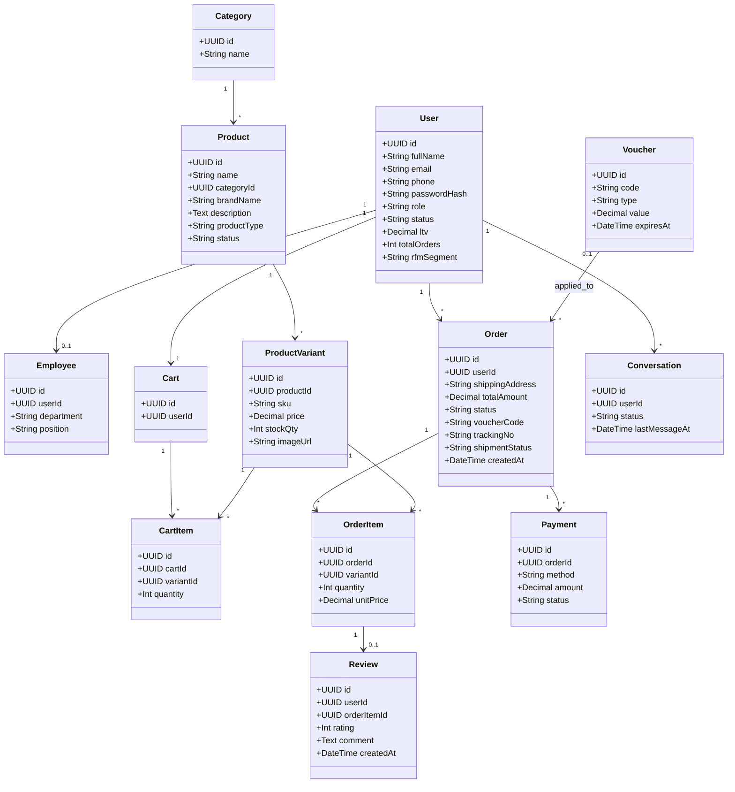
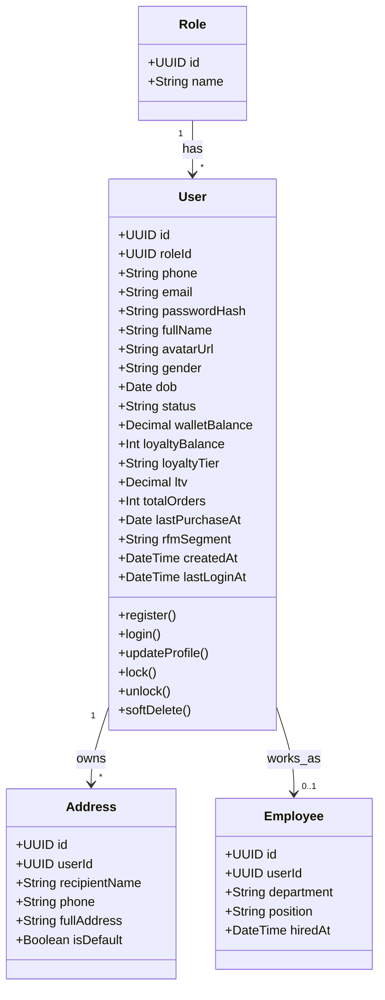
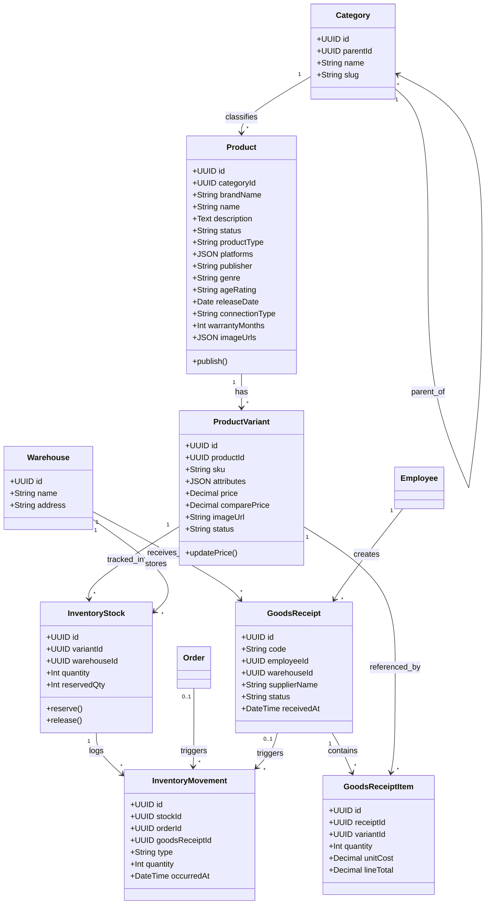
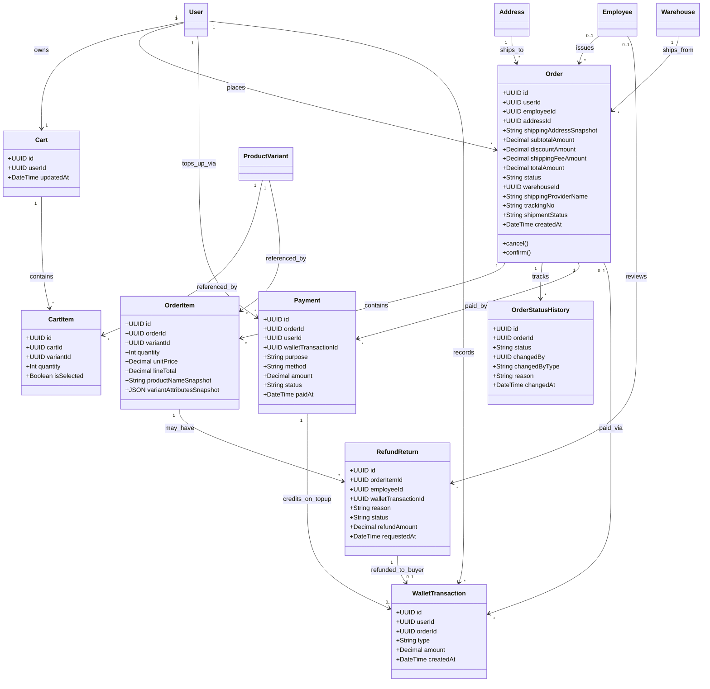
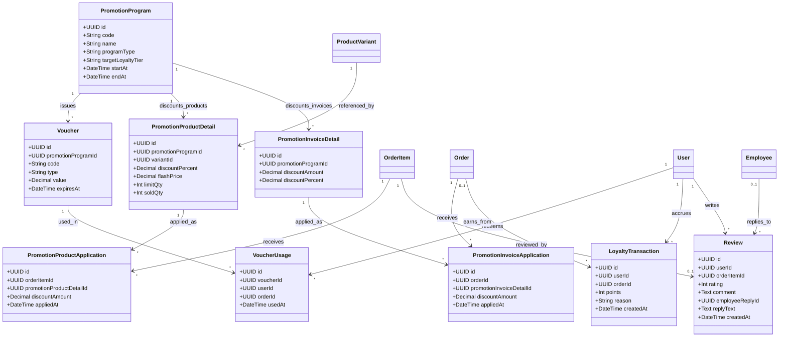
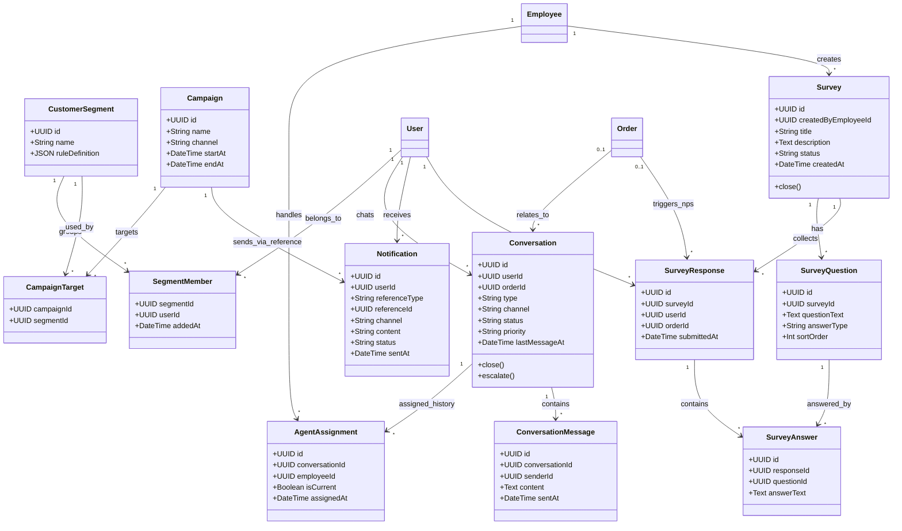

# Class Diagram — Hệ thống CRM + Bán lẻ trực tuyến (1 doanh nghiệp)

> **v17**: 37 → 41 bảng. Khôi phục lại `Survey`/`SurveyQuestion`/`SurveyResponse`/`SurveyAnswer` đã bỏ ở v15 — xác nhận tính năng khảo sát gắn với logic nghiệp vụ CRM của môn Hệ thống thông tin doanh nghiệp, không phải chỉ phục vụ riêng đồ án CNPM nên vẫn cần giữ. Cấu trúc khôi phục nguyên trạng như trước khi bỏ (không đổi field). `Notification.referenceType` thêm lại giá trị `survey`. Xem "Ghi chú thay đổi (v16 → v17)" cuối file.

> **v16**: 41 → 37 bảng. Gộp `Brand` vào `Product.brandName` (string, không tách danh mục thương hiệu). Gộp `ShippingProvider` vào `Order.shippingProviderName` (string, không tách danh mục đơn vị vận chuyển). Gộp `FlashSale`/`FlashSaleItem` vào `PromotionProductDetail` (thêm `flashPrice`/`limitQty`/`soldQty` — trùng chức năng với giảm giá theo sản phẩm đã có, `PromotionProgram.startAt`/`endAt` đóng luôn vai trò khung giờ flash sale); đổi `PromotionProductDetail.productId` → `variantId` để giữ được độ chi tiết theo từng SKU mà `FlashSaleItem` từng có. Giữ nguyên `Warehouse` (đa kho), `Campaign`/`CustomerSegment`, và 2 bảng audit `PromotionProductApplication`/`PromotionInvoiceApplication`, `AgentAssignment` — theo xác nhận vẫn cần. Xem "Ghi chú thay đổi (v15 → v16)" cuối file.

> **v15**: 45 → 41 bảng. Bỏ hẳn tính năng khảo sát (`Survey`/`SurveyQuestion`/`SurveyResponse`/`SurveyAnswer`, thêm ở v7) theo xác nhận là không cần thiết cho phạm vi hệ thống này — chưa có UI nào (web/mobile) triển khai tính năng này nên gỡ an toàn, không ảnh hưởng code đã viết. `Notification.referenceType` bỏ giá trị `survey` khỏi danh sách enum tham khảo. Xem "Ghi chú thay đổi (v14 → v15)" cuối file.

> **v14**: Vá 4 khoảng trống field phát hiện khi rà soát chi tiết 45 bảng (giữ nguyên số bảng, chỉ thêm field): `Order` thêm `shippingAddressSnapshot` (tránh lịch sử đơn đổi hồi tố nếu `Address` bị sửa sau — cùng nguyên tắc snapshot đã áp dụng cho `OrderItem`); `WalletTransaction` thêm `orderId` (truy vết đơn nào được trả bằng ví, trước đây chỉ truy vết được chiều nạp ví); `RefundReturn` thêm `employeeId` (ai duyệt/từ chối yêu cầu đổi trả); `InventoryMovement` thêm `goodsReceiptId` (truy vết biến động `import` về đúng phiếu nhập, đối xứng với `orderId` đã có cho chiều `export`). Đồng thời sửa comment lỗi thời trên `PromotionProgram.targetLoyaltyTier` (còn trỏ tới bảng `LoyaltyPoint` đã gộp vào `User` từ v13). Xem "Ghi chú thay đổi (v13 → v14)" cuối file.

> **v13**: 52 → 45 bảng. Gộp 6 bảng quan hệ 1-1 bắt buộc "râu ria" thẳng vào bảng cha để bớt JOIN và gọn diagram: `Wallet`→`User.walletBalance`, `LoyaltyPoint`→`User.loyaltyBalance/loyaltyTier`, `CustomerProfileCRM`→`User.ltv/totalOrders/lastPurchaseAt/rfmSegment`, `ProductImage`→`Product.imageUrls` (JSON), `ReviewReply`→`Review.employeeReplyId/replyText`, `Shipment`+`ShipmentItem`→gộp thẳng vào `Order` (`warehouseId`/`shippingProviderId`/`trackingNo`/`shipmentStatus`) vì xác nhận **không cần** tính năng giao hàng 1 phần (partial shipment) — 1 đơn luôn ứng với đúng 1 chuyến giao. `AgentAssignment` **giữ nguyên riêng** (không gộp vào `Conversation`) vì cần giữ lịch sử đổi nhân viên xử lý qua thời gian. Xem "Ghi chú thay đổi (v12 → v13)" cuối file.
> **v12**: 50 → 52 bảng. Vá 3 khoảng trống logic nghiệp vụ phát hiện khi rà soát: (1) Thêm `PromotionProductApplication`/`PromotionInvoiceApplication` — theo dõi đơn/dòng đơn nào đã thực sự được áp `PromotionProductDetail`/`PromotionInvoiceDetail` và giảm bao nhiêu tiền, đối xứng với `VoucherUsage` đã có cho `Voucher` (trước đây 2 cơ chế tự động này không có audit trail). (2) `GoodsReceipt` thêm `status` (`pending`/`approved`/`rejected`) — trước đây ghi chú thiết kế nói "sau khi duyệt phiếu" nhưng bảng không có field nào thể hiện trạng thái duyệt. (3) Sửa comment `PromotionProgram.programType` (đã lỗi thời từ v10, viết "khớp voucher.type" trong khi từ v11 1 chương trình có thể không phát hành voucher nào). Xem "Ghi chú thay đổi (v11 → v12)" cuối file.
> **v11**: 48 → 50 bảng. Tái cấu trúc `PromotionProgram` thành 3 cơ chế khuyến mãi con (1 chương trình có thể dùng đồng thời cả 3): `PromotionProductDetail` (Chi tiết khuyến mãi sản phẩm — giảm % theo từng `Product`), `PromotionInvoiceDetail` (Chi tiết khuyến mãi hoá đơn — giảm số tiền cố định và/hoặc % trên tổng hoá đơn), và `Voucher` (Chi tiết khuyến mãi voucher — không đổi, vẫn thuộc `PromotionProgram` từ v10). `Voucher` được rút gọn lại về đúng field gốc (`code`/`type`/`value`/`expiresAt`) — bỏ `discountPercent`/`minOrderAmount`/`maxDiscountAmount` đã thêm ở v10 vì logic đó nay chuyển sang `PromotionInvoiceDetail`. Xem "Ghi chú thay đổi (v10 → v11)" cuối file.
> **v10**: 45 → 48 bảng. Thêm `PromotionProgram` (Chương trình khuyến mãi) — mỗi `Voucher` giờ phụ thuộc vào đúng 1 `PromotionProgram`, chương trình quy định thời gian áp dụng và nhắm tới hạng thành viên (loyalty tier) nào; `Voucher` bổ sung cách tính giảm giá cụ thể (`discountPercent`, `minOrderAmount`, `maxDiscountAmount`). Thêm cặp bảng nhập kho `GoodsReceipt`/`GoodsReceiptItem` (Phiếu nhập hàng/Chi tiết phiếu nhập hàng) ở domain B. `Order` (đóng vai trò Hoá đơn) bổ sung `employeeId` — nhân viên chịu trách nhiệm xuất hoá đơn, tham chiếu `Employee`; `OrderItem` bổ sung `lineTotal` (thành tiền = quantity × unitPrice). Làm rõ thêm ở domain A: `Employee` **liên kết (association)** với `User` qua khoá ngoại `userId`, **không kế thừa/specialization** (không dùng chung khoá chính) — khác với khách hàng vốn không tách bảng riêng mà nằm thẳng trên `User`. Xem "Ghi chú thay đổi (v9 → v10)" cuối file để biết chi tiết lý do.
> **v9**: Chốt ngành hàng kinh doanh cụ thể — công ty bán lẻ **tay cầm chơi game (controller) và đĩa game**. Thêm vào `Product`: `productType` (`game_disc`/`controller`/`accessory`), `platforms` (JSON — nền tảng tương thích: PS5, PS4, Xbox Series X, Nintendo Switch, PC...), `publisher`, `genre`, `ageRating` (PEGI/ESRB, chỉ dùng cho `game_disc`), `releaseDate`, `connectionType` (`wired`/`wireless`/`bluetooth`, chỉ dùng cho `controller`/`accessory`), `warrantyMonths` (chỉ dùng cho hàng phần cứng). Các field chỉ áp dụng cho 1 loại sản phẩm để NULL ở loại còn lại — không tách bảng con riêng cho từng `productType` vì danh mục chỉ có 2-3 loại sản phẩm, tách bảng sẽ là over-engineering.
> **v8**: Gọn hoá schema từ 51 → 45 bảng bằng cách gộp/bỏ các bảng dư thừa hoặc không gắn với yêu cầu chấm điểm nào: gộp `UserProfile` vào `User`, bỏ `ShipmentTracking` (giữ `Shipment.status`), gộp `SupportTicket`/`TicketMessage` vào `Conversation`/`ConversationMessage` (thêm `type`/`orderId`/`status`/`priority`/`channel`), gộp `FeedbackSurvey` vào `Survey`/`SurveyResponse` (thêm `orderId`), bỏ hẳn `InteractionLog`. Các bảng audit-trail thật sự có giá trị (`OrderStatusHistory`, `InventoryMovement`) được giữ nguyên.
> **v7**: Bổ sung `Survey`/`SurveyQuestion`/`SurveyResponse`/`SurveyAnswer` (khảo sát thật, nhiều câu hỏi) và làm rõ `User.status` hỗ trợ khóa/xóa mềm tài khoản khách hàng — đáp ứng đầy đủ các tính năng quản lý khách hàng của CRM (thêm/khóa/xóa mềm khách hàng, tạo-gửi-thống kê khảo sát), vốn là core feature cho cả 2 mục đích dùng chung nền tảng này.
> **v6**: Chuyển từ mô hình **marketplace đa gian hàng** (nhiều Shop độc lập, mỗi Shop tự đăng ký/được duyệt, tự có ví/hoa hồng) sang mô hình **1 doanh nghiệp bán lẻ duy nhất** — toàn bộ Product/Warehouse/Order thuộc thẳng về công ty, không còn khái niệm "Shop" là một bên thứ ba. Nhân sự nội bộ (bán hàng, kho, admin, CSKH) được gom vào 1 entity `Employee`. Lý do đổi: dùng chung nền tảng này cho một đồ án khác yêu cầu hệ thống thông tin cho **một** doanh nghiệp thương mại, không phải sàn TMĐT nhiều người bán.
> Diagram được chia theo 5 domain để dễ đọc: (A) Identity & Company, (B) Catalog & Inventory, (C) Order & Transaction, (D) Marketing & Loyalty, (E) CRM & Customer Care.

---

## 0. Sơ đồ tổng quát (Overview — gộp cả 5 domain)

> Chỉ giữ tên class + quan hệ chính (bỏ thuộc tính/method) để nhìn toàn cảnh kiến trúc và cách 5 domain kết nối với nhau qua các entity dùng chung (`User`, `Product`/`ProductVariant`, `Order`).

```mermaid
classDiagram
    %% ===== A. Identity & Company =====
    class User
    class Address
    class Role
    class Employee

    %% ===== B. Catalog & Inventory =====
    class Category
    class Product
    class ProductVariant
    class Warehouse
    class InventoryStock
    class InventoryMovement
    class GoodsReceipt
    class GoodsReceiptItem

    %% ===== C. Cart -> Order -> Payment -> Shipping =====
    class Cart
    class CartItem
    class Order
    class OrderItem
    class OrderStatusHistory
    class Payment
    class WalletTransaction
    class RefundReturn

    %% ===== D. Marketing & Loyalty =====
    class PromotionProgram
    class PromotionProductDetail
    class PromotionProductApplication
    class PromotionInvoiceDetail
    class PromotionInvoiceApplication
    class Voucher
    class VoucherUsage
    class LoyaltyTransaction
    class Review

    %% ===== E. CRM & Customer Care =====
    class CustomerSegment
    class SegmentMember
    class Campaign
    class CampaignTarget
    class AgentAssignment
    class Conversation
    class ConversationMessage
    class Notification
    class Survey
    class SurveyQuestion
    class SurveyResponse
    class SurveyAnswer

    %% --- A: Identity & Company ---
    User --> Address
    Role --> User
    User --> Employee

    %% --- B: Catalog & Inventory ---
    Category --> Category
    Category --> Product
    Product --> ProductVariant
    ProductVariant --> InventoryStock
    Warehouse --> InventoryStock
    InventoryStock --> InventoryMovement
    Order --> InventoryMovement
    Warehouse --> GoodsReceipt
    Employee --> GoodsReceipt
    GoodsReceipt --> GoodsReceiptItem
    ProductVariant --> GoodsReceiptItem

    %% --- C: Cart/Order/Payment/Shipping ---
    User --> Cart
    Cart --> CartItem
    ProductVariant --> CartItem
    User --> Order
    Address --> Order
    Employee --> Order
    Warehouse --> Order
    Order --> OrderItem
    ProductVariant --> OrderItem
    Order --> OrderStatusHistory
    Order --> Payment
    User --> Payment
    Payment --> WalletTransaction
    OrderItem --> RefundReturn
    RefundReturn --> WalletTransaction
    User --> WalletTransaction

    %% --- D: Marketing & Loyalty ---
    PromotionProgram --> Voucher
    PromotionProgram --> PromotionProductDetail
    ProductVariant --> PromotionProductDetail
    PromotionProductDetail --> PromotionProductApplication
    OrderItem --> PromotionProductApplication
    PromotionProgram --> PromotionInvoiceDetail
    PromotionInvoiceDetail --> PromotionInvoiceApplication
    Order --> PromotionInvoiceApplication
    Voucher --> VoucherUsage
    User --> VoucherUsage
    User --> LoyaltyTransaction
    Order --> LoyaltyTransaction
    User --> Review
    OrderItem --> Review
    Employee --> Review

    %% --- E: CRM & Customer Care ---
    User --> SegmentMember
    CustomerSegment --> SegmentMember
    CustomerSegment --> CampaignTarget
    Campaign --> CampaignTarget
    Employee --> AgentAssignment
    Conversation --> AgentAssignment
    User --> Conversation
    Order --> Conversation
    Conversation --> ConversationMessage
    Order --> SurveyResponse
    User --> Notification
    Campaign --> Notification
    Employee --> Survey
    Survey --> SurveyQuestion
    Survey --> SurveyResponse
    User --> SurveyResponse
    SurveyResponse --> SurveyAnswer
    SurveyQuestion --> SurveyAnswer
```

**Cách đọc nhanh:**
- `User` và `Product`/`ProductVariant`/`Order` là các "trục" chia sẻ dữ liệu giữa các domain — không còn trục `Shop` vì chỉ có 1 doanh nghiệp.
- Domain **A (Identity & Company)** là gốc: mọi domain khác đều phụ thuộc vào `User`. `Employee` **không kế thừa** (không specialization/không dùng chung khoá chính) từ `User` — là 1 bảng độc lập, có `id` riêng, chỉ **liên kết (association)** tới `User` qua khoá ngoại `userId`.
- Domain **B (Catalog)** thuộc thẳng về doanh nghiệp (không qua trung gian Shop nào), là nguồn cho C, D qua `ProductVariant`; `GoodsReceipt`/`GoodsReceiptItem` là chiều nhập hàng vào kho (do `Employee` lập), đối xứng với `Order` là chiều bán ra.
- Domain **C (Order flow)** giờ đơn giản hơn nhiều: 1 lần đặt hàng = 1 `Order` duy nhất (không tách theo nhiều Shop), không còn ví/hoa hồng cho bên thứ ba. `Order` đóng vai trò **hoá đơn bán hàng**: gắn cả `User` (khách mua) lẫn `Employee` (nhân viên chịu trách nhiệm xuất hoá đơn).
- Domain **D (Marketing)** và **E (CRM)** đứng "trên cùng", không có domain nào phụ thuộc ngược vào D/E.

---

## 0.1 Sơ đồ tổng quát rút gọn (dùng để demo)

> Bản rút gọn từ 41 bảng xuống **13 bảng chính** — đủ thể hiện trọn luồng đăng ký/đăng nhập → duyệt sản phẩm → giỏ hàng → đặt hàng/thanh toán/giao hàng → đánh giá → voucher → CRM cơ bản, dùng khi thuyết trình/demo thay vì đi sâu 41 bảng đầy đủ. Thiết kế **thật** (41 bảng) vẫn giữ nguyên ở các sơ đồ A→E bên dưới — bản này không thay thế, chỉ để trình bày nhanh.
>
> Các bảng đã gộp/bỏ so với bản đầy đủ: `Role` → gộp thành field `User.role`; `Address` → gộp thành field `Order.shippingAddress`; `Brand` → gộp thành field `Product.brandName`; `Warehouse`/`InventoryStock`/`InventoryMovement` → gộp thành `ProductVariant.stockQty`; `OrderStatusHistory`, `ShippingProvider`, `WalletTransaction`, `VoucherUsage`, `LoyaltyTransaction`, `RefundReturn`, `FlashSale`/`FlashSaleItem`, `CustomerSegment`/`SegmentMember`/`Campaign`/`CampaignTarget`/`Notification`, `Survey`/`SurveyQuestion`/`SurveyResponse`/`SurveyAnswer`, `AgentAssignment`, `ConversationMessage` — đều bỏ khỏi bản demo vì là bảng phụ/audit-trail/tính năng nâng cao không cần trình bày lúc demo. (`Wallet`, `LoyaltyPoint`, `CustomerProfileCRM`, `ProductImage`, `ReviewReply`, `Shipment`/`ShipmentItem` đã gộp thẳng vào bảng cha ngay ở bản thiết kế thật từ v13, nên demo cũng thừa hưởng luôn — không cần gộp riêng nữa.)

---

## A. Identity & Company

> Thay đổi so với v5: bỏ hẳn `Shop`, `ShopVerification`, `ShopStaff` — không còn khái niệm đăng ký/duyệt một "bên bán" độc lập. Nhân sự nội bộ (bán hàng, kho, quản trị, CSKH) gom vào 1 entity `Employee` gắn với `User`, phân biệt nhau qua `department`.
>
> **v7**: làm rõ ngữ nghĩa `User.status` để đáp ứng yêu cầu "quản lý khách hàng" của CRM — nhận 1 trong các giá trị `active` / `locked` (admin khóa tài khoản, đăng nhập bị chặn) / `deleted` (**xóa mềm** — admin "xóa" khách hàng nhưng bản ghi và toàn bộ lịch sử đơn hàng/giao dịch liên quan vẫn giữ nguyên trong DB, chỉ ẩn khỏi danh sách khách hàng và chặn đăng nhập). Thêm method `lock()`/`unlock()`/`softDelete()` trên `User`.
>
> **v10**: làm rõ theo yêu cầu giảng viên — `Employee` **liên kết (association)** với `User`, **không kế thừa/specialization**. Cụ thể: `Employee` có khoá chính `id` **độc lập** (không dùng chung khoá chính với `User` như mô hình specialization/Class Table Inheritance), chỉ giữ cột khoá ngoại `userId` trỏ tới `User` — đúng bản chất "1 tài khoản `User` có thể (không bắt buộc) đứng tên 1 hồ sơ nhân viên", không phải "`Employee` là 1 dạng con của `User`". Khách hàng thì ngược lại **không tách bảng riêng** — dữ liệu khách hàng nằm thẳng trên `User` (không có bảng `Customer`), nên không phát sinh khái niệm kế thừa nào ở đây để so sánh.
>
> **v13**: `User` gộp thêm field từ 3 bảng 1-1 bắt buộc trước đây tách riêng — `walletBalance` (từ `Wallet`), `loyaltyBalance`/`loyaltyTier` (từ `LoyaltyPoint`), `ltv`/`totalOrders`/`lastPurchaseAt`/`rfmSegment` (từ `CustomerProfileCRM`, domain E). Cả 3 bảng cũ đều dùng `userId` làm khoá chính hoặc khoá duy nhất — nghĩa là **mỗi `User` có đúng 1 dòng tương ứng, không có ngoại lệ**, nên tách bảng riêng chỉ tạo thêm JOIN không cần thiết mà không đổi được ngữ nghĩa (giống lý do đã gộp `UserProfile` vào `User` ở v8).

`Employee.department` là enum nghiệp vụ: `sales` (bán hàng), `warehouse` (kho), `admin` (quản trị hệ thống), `cs` (chăm sóc khách hàng) — dùng để phân tách giao diện quản trị theo từng bộ phận (đúng yêu cầu "giao diện Admin phải tách biệt với giao diện quản lý kho/bán hàng").

---

## B. Catalog & Inventory (có ProductVariant)

> Thay đổi so với v5: `Product` và `Warehouse` không còn `shopId` — toàn bộ catalog và kho thuộc thẳng về doanh nghiệp, không qua trung gian Shop.
>
> **v10**: Thêm `GoodsReceipt`/`GoodsReceiptItem` (Phiếu nhập hàng/Chi tiết phiếu nhập hàng) — ghi nhận nhập hàng vào kho, đối xứng với `Order`/`OrderItem` (chiều bán ra). `GoodsReceipt` do 1 `Employee` lập, nhập vào 1 `Warehouse` cụ thể; `GoodsReceiptItem` giữ `unitCost` (giá nhập, khác `ProductVariant.price` là giá bán) và `lineTotal` (= `quantity` × `unitCost`).
>
> **v12**: Thêm `GoodsReceipt.status` (`pending`/`approved`/`rejected`) — phiếu tạo ra ở trạng thái `pending`, **chỉ khi chuyển sang `approved`** nghiệp vụ mới cộng `InventoryStock.quantity` tương ứng và ghi 1 `InventoryMovement` loại `import` (tái dùng cơ chế audit-trail đã có). Trước v12 thiếu field này nên không có cách nào biểu diễn "phiếu đang chờ duyệt" trong DB.
>
> **v13**: Gộp `ProductImage` vào `Product.imageUrls` (JSON, mảng URL — thứ tự phần tử trong mảng = thứ tự hiển thị) — bảng cũ chỉ có `url`/`sortOrder`, không có hành vi hay ràng buộc riêng nào cần đến 1 bảng SQL độc lập, tách bảng chỉ tốn thêm JOIN mỗi khi hiển thị sản phẩm.
>
> **v14**: `InventoryMovement` thêm `goodsReceiptId` — trước đây chỉ có `orderId` để truy vết biến động kho gây ra bởi bán hàng (chiều `export`), nhưng không có cách nào truy vết biến động `import` (nhập kho) về đúng `GoodsReceipt` đã gây ra nó. Nay đối xứng đủ cả 2 chiều.
>
> **v16**: Gộp `Brand` vào `Product.brandName` (string) — không tách danh mục thương hiệu riêng, đánh đổi chấp nhận được: mất chuẩn hoá tên hãng, đổi lấy bớt 1 bảng.

---

## C. Cart → Order → Payment → Shipping

> Thay đổi so với v5:
> - **Bỏ `Checkout`**: vì chỉ có 1 doanh nghiệp, không cần tách 1 lần thanh toán thành nhiều Order theo nhiều Shop nữa — **1 lần đặt hàng = 1 `Order` duy nhất**. `addressId` chuyển thẳng vào `Order`.
> - **Bỏ `ShopWallet`/`ShopWalletTransaction`/`Payout`/`commissionAmount`**: không còn hoa hồng cho bên thứ ba — tiền bán hàng là doanh thu nội bộ của chính doanh nghiệp, không cần mô hình hoá dòng tiền trả cho "shop" nào cả.
> - `Payment` giờ gắn thẳng vào `Order` (thay vì `Checkout`), vẫn giữ nhánh `walletId`/`purpose` cho nạp ví.
> - `RefundReturn` chỉ còn nối `WalletTransaction` (hoàn tiền cho buyer), bỏ nhánh `ShopWalletTransaction`.
>
> **v10**: `Order` đóng vai trò **hoá đơn bán hàng** — thêm `employeeId` (nhân viên chịu trách nhiệm xuất hoá đơn), là khoá ngoại tham chiếu thẳng tới `Employee` (xem domain A để rõ vì sao `Employee` chỉ liên kết chứ không kế thừa `User`). Để `nullable` (`0..1`) vì đơn khách tự đặt online (self-checkout) không có nhân viên xử lý ngay lúc tạo — chỉ gán khi nhân viên bán hàng xác nhận/xuất hoá đơn cho đơn đó. `OrderItem` thêm `lineTotal` (= `quantity` × `unitPrice`, lưu sẵn thay vì tính lại mỗi lần đọc — đúng vai trò "chi tiết hoá đơn": mã hoá đơn, mã sản phẩm, số lượng bán, đơn giá bán, thành tiền).
>
> **v13**: Gộp `Wallet` vào `User.walletBalance` (domain A) — quan hệ 1-1 bắt buộc, `WalletTransaction`/`Payment` đổi từ trỏ `walletId` sang trỏ thẳng `userId`. Gộp `Shipment`/`ShipmentItem` thẳng vào `Order` (`warehouseId`, `shippingProviderId`, `trackingNo`, `shipmentStatus`) — xác nhận **không cần** tính năng giao hàng 1 phần (partial shipment: 1 đơn tách thành nhiều chuyến giao với nhiều vận đơn khác nhau), nên **1 đơn luôn ứng với đúng 1 lần giao**, tách `Shipment` riêng chỉ tạo thêm JOIN không cần thiết. `ShipmentItem` vốn chỉ tồn tại để biết "vận đơn nào chứa dòng đơn nào" — khi 1 đơn = 1 vận đơn, thông tin đó đã có sẵn qua `OrderItem.orderId`, không cần bảng trung gian nữa.
>
> **v14**: Rà soát field phát hiện 3 khoảng trống: (1) `Order` thêm `shippingAddressSnapshot` — trước đây chỉ giữ `addressId` (tham chiếu), nếu khách sửa `Address` sau khi đặt hàng thì lịch sử đơn cũ bị đổi theo hồi tố; nay snapshot nội dung địa chỉ tại thời điểm đặt hàng, cùng nguyên tắc đã áp dụng cho `OrderItem.productNameSnapshot`. (2) `WalletTransaction` thêm `orderId` — trước đây chỉ `Payment.walletTransactionId` truy vết được chiều nạp ví, không có cách nào biết 1 dòng `WalletTransaction` (type=payment) dùng để trả cho đơn nào khi khách thanh toán bằng số dư ví. (3) `RefundReturn` thêm `employeeId` — trước đây không ghi nhận nhân viên nào đã duyệt/từ chối yêu cầu đổi trả, dù sequence diagram (mục 8, `project-overview.md`) đã mô tả rõ bước này do nhân viên CSKH xử lý.
>
> **v16**: Gộp `ShippingProvider` vào `Order.shippingProviderName` (string) — không tách danh mục đơn vị vận chuyển riêng, tương tự cách đã gộp `Brand`.

---

## D. Marketing & Loyalty

> Thay đổi so với v5: `Voucher` và `FlashSale` bỏ `shopId`/`scope` — chỉ còn ở cấp công ty (không còn phân biệt platform-wide/shop-wide vì chỉ có 1 doanh nghiệp). `ReviewReply` gắn `employeeId` (nhân viên CSKH trả lời) thay vì `shopId`.
>
> **v10**: Thêm `PromotionProgram` (Chương trình khuyến mãi) — mỗi `Voucher` giờ **phụ thuộc vào đúng 1** `PromotionProgram` (không còn voucher độc lập). `PromotionProgram` quy định thời gian áp dụng (`startAt`/`endAt`) và nhắm tới hạng thành viên nào (`targetLoyaltyTier` — khớp giá trị với `LoyaltyPoint.tier`, để trống = áp dụng cho mọi hạng).
>
> **v11**: 1 `PromotionProgram` giờ có thể phát sinh **3 cơ chế giảm giá con** song song, mỗi cơ chế là 1 bảng "chi tiết khuyến mãi" riêng:
> - `PromotionProductDetail` (Chi tiết khuyến mãi sản phẩm): giảm `discountPercent`% cho từng `Product` cụ thể.
> - `PromotionInvoiceDetail` (Chi tiết khuyến mãi hoá đơn): giảm `discountAmount` (số tiền cố định) và/hoặc `discountPercent`% trên **tổng hoá đơn**.
> - `Voucher` (Chi tiết khuyến mãi voucher): không đổi cấu trúc so với v10, chỉ rút gọn lại field — bỏ `discountPercent`/`minOrderAmount`/`maxDiscountAmount` vì cơ chế giảm theo hoá đơn nay đã tách riêng sang `PromotionInvoiceDetail`; `Voucher` chỉ còn giữ đúng vai trò gốc: mã code người dùng tự nhập, giảm theo `type`/`value`. (`PromotionProgram.programType` từ đây chỉ còn là nhãn phân loại chương trình để báo cáo/lọc — không còn ràng buộc phải khớp `Voucher.type`, vì 1 chương trình có thể không phát hành voucher nào cả.)
>
> **v12**: Thêm `PromotionProductApplication`/`PromotionInvoiceApplication` — audit trail cho 2 cơ chế **tự động** (không cần khách nhập mã), đối xứng với `VoucherUsage` đã có sẵn cho `Voucher`. Trước v12, `PromotionProductDetail`/`PromotionInvoiceDetail` chỉ định nghĩa "sẽ giảm bao nhiêu" nhưng không có bảng nào ghi lại "đơn/dòng đơn nào đã thực sự được áp dụng, giảm bao nhiêu tiền" — không thể báo cáo hiệu quả từng chương trình hay audit vì sao 1 đơn bị giảm giá.
>
> **v13**: Gộp `LoyaltyPoint` vào `User.loyaltyBalance`/`loyaltyTier` (domain A) — quan hệ 1-1 bắt buộc, `LoyaltyTransaction.userId` vốn đã trỏ thẳng `users` từ trước nên không đổi gì thêm. Gộp `ReviewReply` vào `Review` (`employeeReplyId`, `replyText`) — quan hệ cũ vốn là 1-1 (`review_id UNIQUE`), tách bảng chỉ tốn thêm JOIN khi hiển thị đánh giá kèm phản hồi.
>
> **v14**: `PromotionProgram.targetLoyaltyTier` giờ khớp giá trị với `User.loyaltyTier` (không còn bảng `LoyaltyPoint` riêng từ v13) — sửa comment lỗi thời trong migration SQL còn trỏ tới bảng đã gộp.
>
> **v16**: Gộp `FlashSale`/`FlashSaleItem` vào `PromotionProductDetail` — 2 cơ chế này trùng chức năng (đều là giảm giá theo sản phẩm/biến thể, có khung thời gian riêng), gộp lại bằng cách thêm `flashPrice`/`limitQty`/`soldQty` làm cơ chế 2 song song với `discountPercent` (cơ chế 1) — nghiệp vụ chọn 1 trong 2. `PromotionProgram.startAt`/`endAt` đóng vai trò khung giờ chung, không cần `FlashSale` tự quản lý thời gian riêng nữa. Đổi `PromotionProductDetail.productId` → `variantId` để không mất độ chi tiết theo từng SKU mà `FlashSaleItem` từng có (1 sản phẩm nhiều biến thể có thể có giá sốc khác nhau).

---

## E. CRM & Customer Care

> Thay đổi so với v5: bỏ entity `Agent` riêng — nhân viên CSKH giờ là `Employee` với `department = "cs"` (tránh trùng lặp với entity mới ở domain A). `Conversation` bỏ `shopId` vì khách chỉ chat với duy nhất 1 doanh nghiệp, không cần phân biệt "chat với shop nào".
>
> **v7**: thêm `Survey`/`SurveyQuestion`/`SurveyResponse`/`SurveyAnswer` — khảo sát thật có nhiều câu hỏi tùy chỉnh do `Employee` tạo, gửi tới khách hàng (qua `Campaign`/`Notification` đã có sẵn, `Notification.referenceType = "survey"`), khách trả lời từng câu. Khác với `FeedbackSurvey` (chỉ 1 điểm NPS gắn cứng theo 1 `Order` cụ thể) — `Survey` là công cụ khảo sát chung (vd: thăm dò trước khi ra mắt sản phẩm mới), không gắn với đơn hàng nào, cả hai cùng tồn tại vì phục vụ mục đích khác nhau.
>
> **v13**: Gộp `CustomerProfileCRM` vào `User.ltv`/`totalOrders`/`lastPurchaseAt`/`rfmSegment` (domain A) — quan hệ 1-1 bắt buộc (`userId` vốn là khoá chính của bảng cũ). `SegmentMember.userId` đổi từ tham chiếu gián tiếp qua `CustomerProfileCRM` (vốn không chính xác về mặt FK — xem ghi chú review trước đó) thành tham chiếu thẳng `users`, đúng với cách SQL đã luôn triển khai.
>
> **v15**: Bỏ hẳn `Survey`/`SurveyQuestion`/`SurveyResponse`/`SurveyAnswer` (thêm ở v7) — xác nhận tính năng khảo sát không cần thiết cho phạm vi hệ thống này. `Notification.referenceType` bỏ giá trị `survey` khỏi danh sách tham khảo.
>
> **v17**: Khôi phục lại `Survey`/`SurveyQuestion`/`SurveyResponse`/`SurveyAnswer` đã bỏ ở v15 — sau khi xem xét lại, tính năng khảo sát gắn với logic nghiệp vụ CRM của môn Hệ thống thông tin doanh nghiệp (đã nêu từ v6/v7), không chỉ phục vụ riêng đồ án CNPM, nên vẫn cần giữ. Cấu trúc khôi phục nguyên trạng như trước khi bỏ. `Notification.referenceType` thêm lại giá trị `survey`.

---

## Ghi chú thay đổi (v16 → v17, khôi phục tính năng khảo sát)

Lý do: sau khi xem xét lại quyết định bỏ khảo sát ở v15, xác nhận tính năng này thật ra gắn với logic nghiệp vụ CRM của môn Hệ thống thông tin doanh nghiệp (module CRM dùng chung nền tảng — đã nêu rõ từ v6/v7 khi thêm `Survey` lần đầu: *"đáp ứng đầy đủ các tính năng quản lý khách hàng của CRM... vốn là core feature cho cả 2 mục đích dùng chung nền tảng này"*), không phải tính năng phụ có thể cắt tuỳ ý như đã đánh giá nhầm ở v15.

- **Khôi phục `Survey`, `SurveyQuestion`, `SurveyResponse`, `SurveyAnswer`**: cấu trúc giữ nguyên như bản gốc trước khi bỏ (không đổi field) — xem lại "Ghi chú thay đổi (v6 → v7)" phía dưới để biết chi tiết thiết kế.
- **`Notification.referenceType`**: thêm lại giá trị `survey` vào danh sách tham khảo.
- **Số bảng: 37 → 41** (+`Survey`, +`SurveyQuestion`, +`SurveyResponse`, +`SurveyAnswer`).

---

## Ghi chú thay đổi (v15 → v16, gộp thêm 3 nhóm bảng "râu ria")

Lý do: sau khi bỏ tính năng khảo sát mà số bảng vẫn còn lớn, rà soát lại lần 2 với góc nhìn khác — không chỉ tìm quan hệ 1-1 bắt buộc (đã hết dư địa từ v13), mà xét luôn các bảng danh mục nhỏ và tính năng trùng lặp chức năng.

- **Gộp `Brand` vào `Product.brandName`** (string): bảng cũ chỉ có `name`/`logoUrl`, không có hành vi riêng. Đánh đổi: mất chuẩn hoá tên hãng (admin gõ tay, dễ sai chính tả giữa các sản phẩm), đổi lấy bớt 1 bảng — chấp nhận được theo yêu cầu.
- **Gộp `ShippingProvider` vào `Order.shippingProviderName`** (string): tương tự `Brand` — bảng cũ chỉ có `name`/`code`, không có hành vi riêng. Đánh đổi: mất danh mục đơn vị vận chuyển chuẩn hoá.
- **Gộp `FlashSale`/`FlashSaleItem` vào `PromotionProductDetail`**: 2 cơ chế giảm giá theo sản phẩm (`PromotionProductDetail` giảm %, `FlashSale` giảm về giá cố định) tồn tại song song từ v11 là dư thừa — cùng bản chất "giảm giá theo sản phẩm/biến thể trong 1 khung thời gian". Gộp bằng cách thêm `flashPrice`/`limitQty`/`soldQty` làm cơ chế 2 (giá sốc cố định) song song với `discountPercent` (cơ chế 1, giảm %) trên cùng 1 bảng — nghiệp vụ chọn 1 trong 2 khi tạo. `PromotionProgram.startAt`/`endAt` đã có sẵn, đóng luôn vai trò khung giờ mà `FlashSale.startAt`/`endAt` từng làm riêng. Đổi `productId` → `variantId` để không mất độ chi tiết theo từng SKU (1 sản phẩm nhiều biến thể có thể giá sốc khác nhau, đúng như `FlashSaleItem` cũ đã làm).
- **Giữ nguyên theo xác nhận**: `Warehouse` (đa kho — không giả định 1 doanh nghiệp chỉ có 1 kho), `Campaign`/`CustomerSegment`/`CampaignTarget`/`SegmentMember` (tính năng marketing tự động hoá theo phân khúc), `PromotionProductApplication`/`PromotionInvoiceApplication` (audit trail khuyến mãi tự động, vừa thêm ở v12), `AgentAssignment` (lịch sử phân công nhân viên xử lý hội thoại).
- **Số bảng: 41 → 37** (-`Brand`, -`ShippingProvider`, -`FlashSale`, -`FlashSaleItem`).

---

## Ghi chú thay đổi (v14 → v15, bỏ tính năng khảo sát)

Lý do: sau khi liệt kê đầy đủ 45 bảng để rà soát khả năng gọn hoá tiếp, xác nhận tính năng khảo sát (`Survey`) không cần thiết cho phạm vi hệ thống này. Khác các lần gộp trước (gộp bảng 1-1 vào bảng cha, vẫn giữ dữ liệu/tính năng), đây là **bỏ hẳn 1 tính năng** — chấp nhận được vì: (1) chưa có UI nào ở web/mobile triển khai khảo sát, gỡ không ảnh hưởng code đã viết; (2) tính năng CRM cốt lõi (quản lý khách hàng, phân khúc, chiến dịch, hỗ trợ/ticket) không phụ thuộc vào `Survey`.

- **Bỏ `Survey`, `SurveyQuestion`, `SurveyResponse`, `SurveyAnswer`**: xoá cả 4 bảng khỏi migration và class diagram (sơ đồ 0 + domain E).
- **`Notification.referenceType`**: bỏ giá trị tham khảo `survey` khỏi comment enum (`order | ticket | campaign | conversation`).
- **Số bảng: 45 → 41**.

---

## Ghi chú thay đổi (v13 → v14, vá 4 khoảng trống field sau khi rà soát 45 bảng)

Lý do: sau khi xác nhận 45 bảng đã ở mức tối giản hợp lý (không thể gộp thêm mà không mất tính năng), rà soát tiếp ở mức **field** của từng bảng thì phát hiện 4 chỗ chưa chính xác/chưa đầy đủ — đều là thiếu field hoặc comment lỗi thời, không đổi số bảng.

- **`Order` thêm `shippingAddressSnapshot`**: trước v14, `Order` chỉ giữ `addressId` (tham chiếu tới `Address`). Nếu khách sửa nội dung địa chỉ đó sau khi đã đặt hàng (đổi số nhà, tên người nhận...), đơn hàng cũ sẽ hiển thị sai lệch so với lúc đặt — đúng vấn đề mà `OrderItem.productNameSnapshot`/`variantAttributesSnapshot` đã né được cho sản phẩm, nhưng `Order` lại bỏ sót cho địa chỉ.
- **`WalletTransaction` thêm `orderId`**: trước v14, chỉ `Payment.walletTransactionId` truy vết được chiều **nạp ví** (topup). Khi khách trả tiền 1 đơn bằng số dư ví có sẵn (`method = wallet`), hệ thống vẫn cần ghi 1 `WalletTransaction` (type=`payment`) để trừ tiền, nhưng không có field nào nối dòng đó về đúng đơn hàng — không truy vết được "ví đã trả cho đơn nào".
- **`RefundReturn` thêm `employeeId`**: sequence diagram "Luồng Đổi trả & Hoàn tiền" (mục 8, `project-overview.md`) mô tả rõ nhân viên CSKH là người duyệt/từ chối yêu cầu đổi trả, nhưng bảng chưa có field nào ghi nhận ai đã xử lý — không audit được trách nhiệm.
- **`InventoryMovement` thêm `goodsReceiptId`**: bảng đã có `orderId` để biết biến động kho nào do bán hàng gây ra (chiều `export`), nhưng thiếu field tương ứng cho chiều `import` (nhập kho) — không truy vết được biến động nào do `GoodsReceipt` nào gây ra.
- **Sửa comment lỗi thời trên `PromotionProgram.targetLoyaltyTier`**: migration SQL còn ghi "khớp giá trị với `loyalty_points.tier`" — bảng này đã gộp vào `users.loyalty_tier` từ v13, comment chưa được cập nhật theo.
- **Số bảng: giữ nguyên 45** (chỉ thêm field, không thêm/bớt bảng).

---

## Ghi chú thay đổi (v12 → v13, gộp bảng "râu ria" 1-1 vào bảng cha)

Lý do: rà soát lại toàn bộ 52 bảng, phát hiện 6 bảng có quan hệ **1-1 bắt buộc** với đúng 1 bảng cha (không có ngoại lệ nào cần tồn tại độc lập) — tách riêng chỉ tốn thêm JOIN ở mọi truy vấn mà không đổi được ngữ nghĩa, đúng nguyên tắc đã áp dụng khi gộp `UserProfile` vào `User` ở v8.

- **`Wallet` → `User.walletBalance`**: mỗi `User` có đúng 1 ví (`wallets.user_id UNIQUE NOT NULL`). `WalletTransaction`/`Payment` đổi từ trỏ `walletId` sang trỏ thẳng `userId`.
- **`LoyaltyPoint` → `User.loyaltyBalance`/`loyaltyTier`**: tương tự, `loyalty_points.user_id UNIQUE NOT NULL`. `LoyaltyTransaction.userId` không đổi (đã trỏ thẳng `users` từ trước).
- **`CustomerProfileCRM` → `User.ltv`/`totalOrders`/`lastPurchaseAt`/`rfmSegment`**: bảng cũ dùng `user_id` làm khoá chính — chính là quan hệ 1-1 rõ ràng nhất trong 6 bảng này. Nhân tiện sửa luôn điểm đã ghi nhận ở lần review trước: `SegmentMember.userId` trước đây được vẽ nối qua `CustomerProfileCRM` dù SQL luôn tham chiếu thẳng `users` — nay đúng cả 2 chiều.
- **`ProductImage` → `Product.imageUrls`** (JSON): bảng cũ chỉ có `url`/`sortOrder`, không có hành vi hay ràng buộc riêng.
- **`ReviewReply` → `Review.employeeReplyId`/`replyText`**: bảng cũ có `review_id UNIQUE` — đúng 1-1 với `Review`.
- **`Shipment`+`ShipmentItem` → gộp vào `Order`** (`warehouseId`, `shippingProviderId`, `trackingNo`, `shipmentStatus`): xác nhận với người yêu cầu là **không cần** tính năng giao hàng 1 phần (partial shipment — 1 đơn tách thành nhiều chuyến giao với nhiều vận đơn khác nhau). Khi quy tắc là "1 đơn = 1 lần giao trọn gói", `Shipment` không còn lý do tồn tại độc lập với `Order`, và `ShipmentItem` (vốn chỉ để biết "vận đơn nào chứa dòng đơn nào") cũng thừa theo vì thông tin đó đã có sẵn qua `OrderItem.orderId`.
- **Không gộp `AgentAssignment` vào `Conversation`** (dù cũng là ứng viên "râu ria"): khác 6 bảng trên, quan hệ này **không phải 1-1** — 1 `Conversation` có thể có nhiều `AgentAssignment` theo thời gian (`isCurrent` đánh dấu nhân viên đang xử lý). Gộp sẽ làm mất khả năng xem lại lịch sử đổi nhân viên phụ trách — quyết định giữ nguyên sau khi xác nhận với người yêu cầu.
- **Số bảng: 52 → 45** (-`Wallet`, -`LoyaltyPoint`, -`CustomerProfileCRM`, -`ProductImage`, -`ReviewReply`, -`Shipment`, -`ShipmentItem`).

---

## Ghi chú thay đổi (v11 → v12, vá khoảng trống logic nghiệp vụ)

Lý do: rà soát lại toàn bộ thiết kế theo yêu cầu kiểm tra "logic nghiệp vụ đã đúng và đầy đủ chưa", phát hiện 3 điểm còn thiếu so với ghi chú thiết kế đã viết trước đó.

- **Thêm `PromotionProductApplication`/`PromotionInvoiceApplication`**: `Voucher` có `VoucherUsage` để biết đơn nào đã dùng voucher nào, giảm bao nhiêu — nhưng `PromotionProductDetail`/`PromotionInvoiceDetail` (2 cơ chế tự động, không cần khách nhập mã) lại không có bảng tương ứng. Hệ quả: sau khi đơn được tạo, không có cách nào biết đơn đó đã được áp khuyến mãi sản phẩm/hoá đơn nào, giảm bao nhiêu từ nguồn nào — `Order.discountAmount` chỉ là 1 con số gộp, không tách được theo nguồn. 2 bảng mới ghi lại đúng những gì đã áp dụng thật cho từng đơn/dòng đơn, đối xứng với `VoucherUsage`.
- **`GoodsReceipt` thêm `status`**: ghi chú thiết kế ở v10 đã viết "sau khi duyệt phiếu nhập, nghiệp vụ sẽ cộng `InventoryStock.quantity`" nhưng bảng chưa có field nào thể hiện trạng thái duyệt — nghĩa là về mặt schema, không có cách nào phân biệt phiếu đang chờ duyệt với phiếu đã duyệt. Thêm `status` (`pending`/`approved`/`rejected`) để đúng với luồng đã mô tả.
- **Sửa comment `PromotionProgram.programType`**: comment cũ (từ v10) viết "khớp `voucher.type`", nhưng từ v11 một chương trình có thể chỉ tạo `PromotionProductDetail`/`PromotionInvoiceDetail` mà không phát hành voucher nào — ràng buộc "phải khớp voucher.type" không còn đúng trong mọi trường hợp. Sửa lại thành mô tả trung lập: chỉ là nhãn phân loại chương trình.
- **Số bảng: 50 → 52** (+`PromotionProductApplication`, +`PromotionInvoiceApplication`).

---

## Ghi chú thay đổi (v10 → v11, tách 3 cơ chế khuyến mãi con trong Chương trình khuyến mãi)

Lý do: làm rõ theo yêu cầu — 1 chương trình khuyến mãi trong thực tế thường không chỉ phát hành voucher, mà còn có thể giảm giá trực tiếp theo từng sản phẩm hoặc theo tổng hoá đơn, không cần khách phải nhập mã. Tách rõ 3 cơ chế thành 3 bảng riêng thay vì nhồi hết field vào `Voucher` (như đã làm tạm ở v10) — mỗi cơ chế có ngữ nghĩa và điều kiện áp dụng khác nhau, gộp chung sẽ khiến nhiều field luôn `NULL` tuỳ loại, khó đọc.

- **Thêm `PromotionProductDetail`** (Chi tiết khuyến mãi sản phẩm): `promotionProgramId`, `productId`, `discountPercent` — giảm giá áp trực tiếp lên 1 `Product` khi đang trong thời gian chương trình chạy (`PromotionProgram.startAt`/`endAt`), không cần khách thao tác gì thêm. Dùng `productId` (không phải `variantId`) vì khuyến mãi kiểu này thường áp theo cả dòng sản phẩm, không phân biệt biến thể.
- **Thêm `PromotionInvoiceDetail`** (Chi tiết khuyến mãi hoá đơn): `promotionProgramId`, `discountAmount` (số tiền giảm cố định), `discountPercent` — giảm trực tiếp trên **tổng giá trị hoá đơn** (`Order.totalAmount`), tự động áp dụng chứ không cần mã như `Voucher`. Giữ cả 2 field số tiền và % vì 1 chương trình có thể chọn 1 trong 2 cách tính (nghiệp vụ tự quyết định dùng field nào, field còn lại để `NULL`).
- **Rút gọn `Voucher`**: bỏ `discountPercent`/`minOrderAmount`/`maxDiscountAmount` đã thêm ở v10 — các field đó đã có "nhà" rõ ràng hơn ở `PromotionInvoiceDetail`. `Voucher` quay lại đúng vai trò gốc (từ v1-v9): khách phải **chủ động nhập mã** (`code`) lúc checkout, giảm theo `type`/`value`, khác biệt với 2 bảng trên ở chỗ **cần hành động của khách hàng** để áp dụng.
- **Số bảng: 48 → 50** (+`PromotionProductDetail`, +`PromotionInvoiceDetail`).

---

## Ghi chú thay đổi (v9 → v10, thêm Chương trình khuyến mãi, Phiếu nhập hàng, Hoá đơn = Order mở rộng)

Lý do: giảng viên yêu cầu bổ sung các bảng nghiệp vụ bán lẻ/kế toán kinh điển (chương trình khuyến mãi gắn hạng thành viên, phiếu nhập hàng, hoá đơn bán hàng có nhân viên chịu trách nhiệm) — đúng tinh thần dùng chung nền tảng này cho môn Hệ thống thông tin doanh nghiệp (đã nêu ở v6/v7), không phải chỉ đáp ứng riêng đồ án CNPM.

- **Thêm `PromotionProgram`**: mỗi `Voucher` giờ bắt buộc thuộc về đúng 1 chương trình khuyến mãi thay vì tồn tại độc lập. `PromotionProgram` có `code`, `name`, `programType`, `startAt`/`endAt`, và `targetLoyaltyTier` để giới hạn chương trình chỉ áp dụng cho 1 hạng thành viên cụ thể (khớp giá trị với `LoyaltyPoint.tier` đã có sẵn — không tạo bảng `Tier` riêng vì hạng thành viên chỉ là vài giá trị cố định, dùng string là đủ). `Voucher.type` phải đồng nhất với `PromotionProgram.programType` — ràng buộc nghiệp vụ (check ở service layer khi tạo voucher), không cần CHECK constraint ở DB vì `programType`/`type` là 2 enum tự do, khó ràng buộc cứng bằng SQL CHECK mà không cứng hoá danh sách giá trị.
- **`Voucher` bổ sung công thức tính giảm giá**: `discountPercent` (giảm bao nhiêu %), `minOrderAmount` (đơn tối thiểu bao nhiêu mới được áp dụng), `maxDiscountAmount` (giảm tối đa bao nhiêu — chặn trần khi áp % lên đơn giá trị lớn). Giữ nguyên `value` (dùng cho voucher giảm theo số tiền cố định, `type = fixed_amount`) — `discountPercent`/`maxDiscountAmount` chỉ có ý nghĩa khi `type = percentage`, để `NULL` ở trường hợp còn lại (cùng nguyên tắc với field đặc thù `productType` trên `Product` ở v9).
- **Thêm `GoodsReceipt`/`GoodsReceiptItem`** (Phiếu nhập hàng/Chi tiết phiếu nhập hàng): đối xứng với `Order`/`OrderItem` ở chiều nhập hàng vào kho thay vì bán ra. `GoodsReceipt` do 1 `Employee` lập, nhập vào 1 `Warehouse`; `GoodsReceiptItem` có `unitCost` (giá nhập — khác `ProductVariant.price` là giá bán) và `lineTotal` lưu sẵn. Sau khi duyệt phiếu, nghiệp vụ cộng `InventoryStock.quantity` và ghi 1 `InventoryMovement` loại `import` — tái dùng cơ chế audit-trail đã có, không tạo thêm bảng lịch sử riêng cho nhập kho.
- **`Order` đóng vai trò hoá đơn bán hàng, thêm `employeeId`**: nhân viên chịu trách nhiệm xuất hoá đơn, tham chiếu tới `Employee`. Để `nullable` (`0..1`) vì đơn khách tự đặt online không có nhân viên xử lý ngay lúc tạo.
- **Làm rõ quan hệ `Employee` ↔ `User` (theo đúng yêu cầu giảng viên: "nhân viên liên kết với `User` nhưng không kế thừa như khách hàng")**: `Employee` có khoá chính `id` **độc lập**, chỉ giữ cột khoá ngoại `userId` trỏ tới `User` — đây là quan hệ **liên kết (association)** thường, **không phải specialization/kế thừa** (kế thừa đúng nghĩa trong mô hình quan hệ sẽ là `Employee` dùng chung khoá chính với `User`, tức `employees.id = users.id`, kiểu Class Table Inheritance — thiết kế hiện tại **không** làm vậy). Khách hàng thì không tách bảng riêng — dữ liệu khách hàng nằm thẳng trên `User`, nên không có khái niệm kế thừa nào phát sinh ở phía khách hàng để so sánh; điểm khác biệt cốt lõi là `Employee` **có tồn tại như 1 entity riêng, tách khỏi `User`**, còn "khách hàng" thì không.
- **`OrderItem` thêm `lineTotal`**: đúng vai trò "chi tiết hoá đơn" (mã hoá đơn, mã sản phẩm, số lượng bán, đơn giá bán, thành tiền) — lưu sẵn `quantity × unitPrice` thay vì tính lại mỗi lần đọc, nhất quán với `GoodsReceiptItem.lineTotal` ở chiều nhập.
- **Số bảng: 45 → 48** (+`PromotionProgram`, +`GoodsReceipt`, +`GoodsReceiptItem`).

---

## Ghi chú thay đổi (v5 → v6, chuyển sang mô hình 1 doanh nghiệp duy nhất)

- **Bỏ `Shop`, `ShopVerification`, `ShopStaff`**: không còn khái niệm bên bán thứ ba tự đăng ký/được duyệt. Toàn bộ `Product`, `Warehouse` giờ thuộc thẳng về doanh nghiệp (bỏ `shopId` khỏi cả hai).
- **Thêm `Employee`** (thay `ShopStaff`): gắn với `User`, có `department` (`sales`/`warehouse`/`admin`/`cs`) — vừa đại diện nhân sự nội bộ, vừa là cơ sở để tách giao diện quản trị theo bộ phận.
- **Bỏ `Checkout`**: 1 lần đặt hàng giờ luôn ra đúng 1 `Order` (trước đây `Checkout` cần thiết để tách 1 giỏ hàng đa-shop thành nhiều Order — không còn cần vì chỉ có 1 doanh nghiệp). `Payment` và `Address` gắn thẳng vào `Order`.
- **Bỏ `ShopWallet`, `ShopWalletTransaction`, `Payout`, field `commissionAmount` trên `Order`**: không còn hoa hồng/rút tiền cho bên thứ ba. `RefundReturn` chỉ còn hoàn tiền cho buyer qua `WalletTransaction`.
- **`Voucher`/`FlashSale` bỏ `shopId`/`scope`**: chỉ còn ở cấp công ty, không cần phân biệt platform-wide/shop-wide nữa.
- **`ReviewReply.shopId` → `employeeId`**: nhân viên CSKH (một `Employee`) là người trả lời đánh giá, không phải "shop" trả lời.
- **Bỏ entity `Agent` riêng, dùng `Employee` (department = "cs")**: tránh trùng lặp giữa "nhân viên nội bộ nói chung" và "nhân viên CSKH" — cả hai giờ là cùng 1 khái niệm `Employee`, chỉ khác `department`.
- **`Conversation` bỏ `shopId`**: khách chỉ chat với duy nhất 1 doanh nghiệp nên không cần định danh "chat với shop nào".

## Ghi chú thay đổi (v6 → v7, bổ sung tính năng CRM còn thiếu)

Lý do: rà soát lại yêu cầu môn Hệ thống thông tin doanh nghiệp (mục CRM) phát hiện các tính năng quản lý khách hàng cốt lõi của CRM chưa được mô hình hoá đầy đủ — đây cũng là tính năng lõi cần cho chính đồ án CNPM (domain E vốn đã đặt tên "CRM & Customer Care" từ đầu), không phải chỉ để đáp ứng riêng môn HTTTDN.

- **Thêm `Survey`, `SurveyQuestion`, `SurveyResponse`, `SurveyAnswer`**: khảo sát thật có nhiều câu hỏi tùy chỉnh, do `Employee` tạo, gửi tới khách hàng (tái dùng `Campaign`/`Notification` đã có — `Notification.referenceType = "survey"` — không cần thêm quan hệ mới giữa `Campaign` và `Survey`), khách trả lời từng câu qua `SurveyAnswer`. Đáp ứng đúng yêu cầu "tạo bảng khảo sát, gửi đến khách hàng, thống kê kết quả" — điều mà `FeedbackSurvey` (chỉ 1 điểm NPS gắn cứng theo `Order`) không làm được.
- **Làm rõ `User.status`** (`active`/`locked`/`deleted`) + thêm method `lock()`/`unlock()`/`softDelete()`: đáp ứng "khóa tài khoản khách hàng" và "xóa khách hàng" — chọn **xóa mềm** (đổi `status` sang `deleted`, giữ nguyên toàn bộ bản ghi + lịch sử đơn hàng/giao dịch liên quan trong DB) thay vì xóa cứng, đúng thực hành chuẩn (xóa cứng sẽ phá vỡ tính toàn vẹn tham chiếu của `Order`/`Payment`/`Review`... đã trỏ tới `userId` đó).
- **Không thêm entity mới cho "báo cáo tỷ lệ độ tuổi, sở thích khách hàng"**: đây là báo cáo tổng hợp (aggregate), tính trực tiếp từ dữ liệu đã có sẵn — độ tuổi từ `UserProfile.dob`, sở thích/ngành hàng ưa chuộng suy ra từ lịch sử `Order`→`OrderItem`→`Product`→`Category`. Không cần lưu thêm trường "sở thích" riêng vì dữ liệu hành vi mua hàng đã đủ để tính.
- **Không thêm API "admin thêm khách hàng mới" như một entity/quan hệ mới**: tái dùng thẳng `User` (domain A) — chỉ là một cách tạo `User` khác (do admin tạo thay vì khách tự đăng ký), không đổi cấu trúc dữ liệu.

## Ghi chú thay đổi (v8 → v9, chốt ngành hàng: tay cầm chơi game & đĩa game)

Lý do: chốt lại đây là hệ thống cho một công ty bán lẻ cụ thể — chuyên **tay cầm chơi game (controller)** và **đĩa game**, không phải bán lẻ đa ngành hàng chung chung. Thêm field đặc thù ngành vào `Product` thay vì tách bảng con `GameDisc`/`Controller` riêng, vì:
- Danh mục chỉ có 2-3 `productType` (`game_disc`, `controller`, `accessory`), số field đặc thù mỗi loại ít (4-5 field) — tách bảng riêng sẽ phải JOIN thêm ở mọi truy vấn catalog mà không có lợi ích rõ ràng.
- Các field không dùng đến ở `productType` khác chỉ đơn giản để `NULL`.

Field mới trên `Product`:
- **`productType`** (`game_disc`/`controller`/`accessory`): phân biệt loại sản phẩm để biết field nào áp dụng.
- **`platforms`** (JSON, mảng chuỗi — vd `["PS5","PS4"]`): nền tảng tương thích. Dùng JSON thay vì bảng M-N riêng vì đây là thuộc tính hiển thị/lọc, không cần truy vấn quan hệ phức tạp; dùng chung được cho cả đĩa game (thường 1 platform) và tay cầm (thường nhiều platform).
- **`publisher`**, **`genre`**, **`ageRating`** (PEGI/ESRB): chỉ áp dụng cho `game_disc` — thông tin bắt buộc phải hiển thị khi bán đĩa game.
- **`releaseDate`**: ngày phát hành, áp dụng cho cả 2 loại (game mới ra mắt / tay cầm đời mới).
- **`connectionType`** (`wired`/`wireless`/`bluetooth`): chỉ áp dụng cho `controller`/`accessory`.
- **`warrantyMonths`**: số tháng bảo hành, chỉ áp dụng cho hàng phần cứng (`controller`/`accessory`) — đĩa game không có khái niệm bảo hành.

## Ghi chú thay đổi (v7 → v8, gọn hoá schema 51 → 45 bảng)

Lý do: rà soát lại toàn bộ 51 bảng sau khi viết migration thật, phát hiện một số bảng dư thừa (tách 1-1 không cần thiết, hoặc trùng chức năng với bảng khác) hoặc không gắn với bất kỳ yêu cầu chấm điểm nào của cả 2 môn. Giữ nguyên các bảng audit-trail thật sự có giá trị (`OrderStatusHistory`, `InventoryMovement`) vì có gắn với yêu cầu cụ thể (lịch sử trạng thái đơn hàng, biến động tồn kho).

- **Gộp `UserProfile` vào `User`**: `fullName`, `avatarUrl`, `gender`, `dob` chuyển thẳng thành field của `User`. Đây là quan hệ 1-1 bắt buộc (mọi `User` đều có đúng 1 profile) nên tách bảng riêng chỉ tạo thêm 1 JOIN không cần thiết mà không có lợi ích gì (không có trường hợp nào cần `UserProfile` tồn tại độc lập với `User`).
- **Bỏ `ShipmentTracking`**: chỉ giữ `Shipment.status` (đủ để biết trạng thái hiện tại). Lịch sử chi tiết từng mốc vận chuyển (`picked_up`, `in_transit`, `delivered`...) không gắn với yêu cầu chấm điểm nào — khác với `OrderStatusHistory` (giữ lại) vốn cần để hiển thị lịch sử đơn hàng cho khách.
- **Gộp `SupportTicket` + `TicketMessage` vào `Conversation` + `ConversationMessage`**: thêm `type` (`'ticket'`/`'chat'`), `orderId`, `status`, `priority`, `channel` vào `Conversation`; `AgentAssignment.ticketId` đổi thành `AgentAssignment.conversationId`. Hai cặp bảng này vốn cùng là "hội thoại giữa khách và nhân viên", chỉ khác ngữ cảnh (ticket hỗ trợ có `status`/`priority`, chat thường thì không) — dùng 1 field `type` để phân biệt thay vì 2 bộ bảng song song giống hệt nhau về cấu trúc.
- **Gộp `FeedbackSurvey` vào `Survey`/`SurveyResponse`**: thêm `orderId` (nullable) vào `SurveyResponse`. `FeedbackSurvey` chỉ là "khảo sát 1 câu hỏi (điểm NPS) gắn với 1 Order" — một trường hợp đặc biệt của `Survey` chung, không cần bảng riêng.
- **Bỏ hẳn `InteractionLog`**: log hành vi chung chung (`type`, `metadata` JSON) không gắn với bất kỳ yêu cầu báo cáo/chấm điểm nào ở cả 2 môn — khác `OrderStatusHistory`/`InventoryMovement` vốn phục vụ tính năng cụ thể (tracking đơn hàng, quản lý kho).

## Ghi chú thay đổi (v1 → v2, sau review)

- **Thêm `ProductVariant`**: `Product` chỉ còn là "sản phẩm cha" (tên, mô tả, category, brand). Giá, `comparePrice`, `attributes` (màu/size...), ảnh đại diện và tồn kho chuyển hết sang `ProductVariant`. Lý do: một sàn kiểu Shopee bắt buộc phải hỗ trợ giá/tồn kho khác nhau theo tổ hợp biến thể — đây là hành vi tối thiểu, không phải tính năng phụ.
- **`CartItem`, `OrderItem`, `FlashSaleItem`, `InventoryStock`**: đổi tham chiếu từ `productId` sang `variantId`.
- **Thêm snapshot trên `OrderItem`** (`productNameSnapshot`, `variantAttributesSnapshot`): tránh lịch sử đơn hàng bị sai/lỗi khi sản phẩm bị đổi tên hoặc xóa sau này.
- **`Review` bắt buộc gắn `orderItemId`**: enforce "chỉ review khi đã mua" (verified purchase).
- **Thêm `Brand`**: sản phẩm có thương hiệu riêng, tách khỏi `Category`.
- Giữ nguyên quyết định gộp `UserRole` vào `User` (xem phần bên dưới).

## Gộp UserRole vào User — có đánh đổi gì?

**Được lợi:**
- Query "lấy role của user" hoặc "lọc user theo role" không cần `JOIN` nữa — chỉ `WHERE role_id = ?`, nhanh hơn và đơn giản hơn khi có index trên `role_id`.
- Ít bảng, ít write (insert user chỉ 1 câu INSERT thay vì 2).

**Mất gì:**
- Chỉ còn hỗ trợ **1 user – 1 role tại một thời điểm**. Nếu nghiệp vụ cần multi-role thật (vd: một user vừa là buyer vừa là nhân viên CSKH cùng lúc, cần bật/tắt độc lập), cấu trúc này không biểu diễn được — phải thêm cột enum bitmask hoặc quay lại bảng trung gian.
- Trong hệ thống này (v6) thì **không sao**, vì vai trò nhân sự nội bộ đã tách hẳn sang `Employee`:
  - "Nhân viên nội bộ" (bán hàng/kho/admin/CSKH) → đại diện qua `Employee.department`, không cần đụng tới `Role`.
  - `Role` trên `User` chỉ cần đại diện vai trò **hệ thống cấp cao, loại trừ nhau** (buyer / admin), nên gộp 1-1 vẫn hợp lý và không làm giảm tối ưu — ngược lại còn nhanh hơn vì bớt 1 JOIN ở hầu hết query auth/permission (vốn là đường nóng, chạy mỗi request).

**Kết luận:** gộp không giảm tối ưu ở đây, mà còn tăng tốc do bớt JOIN — miễn là bạn chấp nhận ràng buộc "mỗi user 1 role hệ thống", còn vai trò nhân sự nội bộ thực tế đã được tách sang `Employee`.
