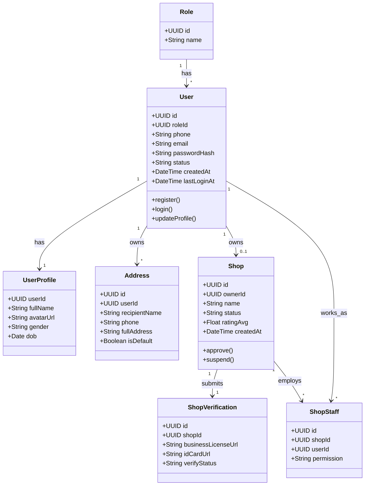
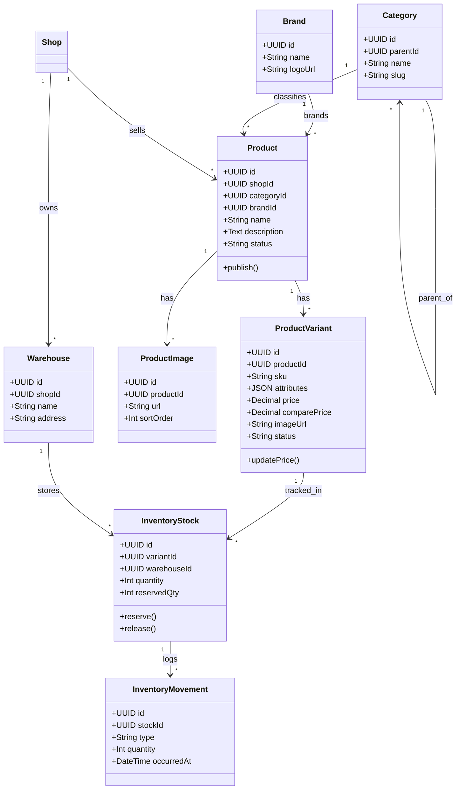
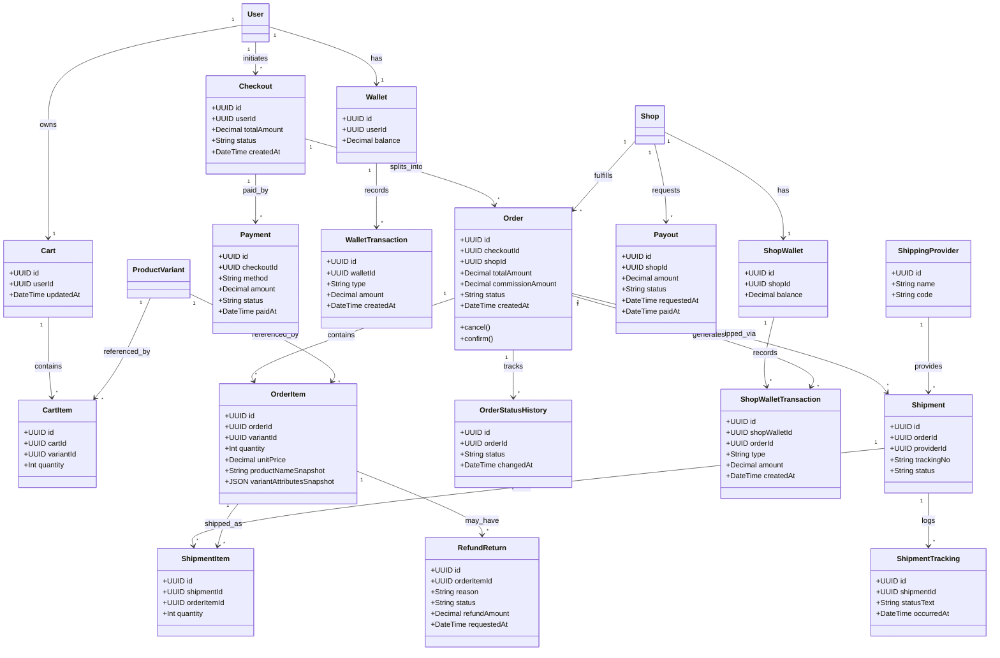
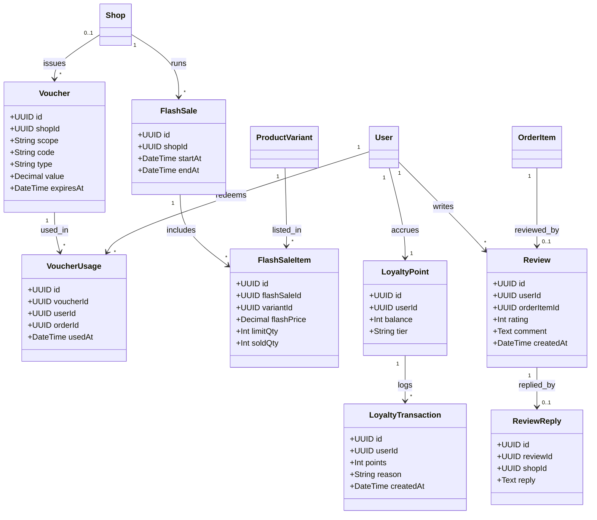
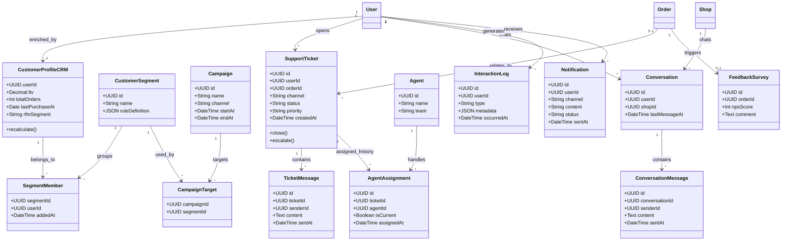

# Class Diagram — Hệ thống CRM + E-commerce (kiểu Shopee)

> **v2**: Có `ProductVariant` (SKU) — mỗi `Product` là "sản phẩm cha" (tên, mô tả, ảnh chung), còn giá/tồn kho/thuộc tính (màu/size...) nằm ở `ProductVariant`. Đây là thay đổi so với bản v1 (đã bỏ SKU) sau khi review lại: một sàn kiểu Shopee cần giá/tồn kho khác nhau theo từng tổ hợp biến thể.
> Diagram được chia theo 5 domain để dễ đọc: (A) Identity & Shop, (B) Catalog & Inventory, (C) Order & Transaction, (D) Marketing & Loyalty, (E) CRM & Customer Care.

---

## 0. Sơ đồ tổng quát (Overview — gộp cả 5 domain)

> Chỉ giữ tên class + quan hệ chính (bỏ thuộc tính/method) để nhìn toàn cảnh kiến trúc và cách 5 domain kết nối với nhau qua các entity dùng chung (`User`, `Shop`, `Product`, `ProductVariant`, `Order`).

```mermaid
classDiagram
    %% ===== A. Identity & Shop =====
    class User
    class UserProfile
    class Address
    class Role
    class Shop
    class ShopVerification
    class ShopStaff

    %% ===== B. Catalog & Inventory =====
    class Brand
    class Category
    class Product
    class ProductVariant
    class ProductImage
    class Warehouse
    class InventoryStock
    class InventoryMovement

    %% ===== C. Cart -> Checkout -> Order -> Payment -> Shipping =====
    class Cart
    class CartItem
    class Checkout
    class Order
    class OrderItem
    class OrderStatusHistory
    class Payment
    class Wallet
    class WalletTransaction
    class ShopWallet
    class ShopWalletTransaction
    class Payout
    class ShippingProvider
    class Shipment
    class ShipmentItem
    class ShipmentTracking
    class RefundReturn

    %% ===== D. Marketing & Loyalty =====
    class Voucher
    class VoucherUsage
    class FlashSale
    class FlashSaleItem
    class LoyaltyPoint
    class LoyaltyTransaction
    class Review
    class ReviewReply

    %% ===== E. CRM & Customer Care =====
    class CustomerProfileCRM
    class CustomerSegment
    class SegmentMember
    class Campaign
    class CampaignTarget
    class SupportTicket
    class TicketMessage
    class Agent
    class AgentAssignment
    class Conversation
    class ConversationMessage
    class InteractionLog
    class FeedbackSurvey
    class Notification

    %% --- A: Identity & Shop ---
    User --> UserProfile
    User --> Address
    Role --> User
    User --> Shop
    Shop --> ShopVerification
    Shop --> ShopStaff
    User --> ShopStaff

    %% --- B: Catalog & Inventory ---
    Brand --> Product
    Category --> Category
    Category --> Product
    Shop --> Product
    Product --> ProductVariant
    Product --> ProductImage
    Shop --> Warehouse
    ProductVariant --> InventoryStock
    Warehouse --> InventoryStock
    InventoryStock --> InventoryMovement

    %% --- C: Cart/Checkout/Order/Payment/Shipping ---
    User --> Cart
    Cart --> CartItem
    ProductVariant --> CartItem
    User --> Checkout
    Checkout --> Order
    Shop --> Order
    Order --> OrderItem
    ProductVariant --> OrderItem
    Order --> OrderStatusHistory
    Checkout --> Payment
    Order --> Shipment
    ShippingProvider --> Shipment
    Shipment --> ShipmentItem
    OrderItem --> ShipmentItem
    Shipment --> ShipmentTracking
    OrderItem --> RefundReturn
    User --> Wallet
    Wallet --> WalletTransaction
    Shop --> ShopWallet
    ShopWallet --> ShopWalletTransaction
    Order --> ShopWalletTransaction
    Shop --> Payout

    %% --- D: Marketing & Loyalty ---
    Shop --> Voucher
    Voucher --> VoucherUsage
    User --> VoucherUsage
    Shop --> FlashSale
    FlashSale --> FlashSaleItem
    ProductVariant --> FlashSaleItem
    User --> LoyaltyPoint
    LoyaltyPoint --> LoyaltyTransaction
    User --> Review
    OrderItem --> Review
    Review --> ReviewReply

    %% --- E: CRM & Customer Care ---
    User --> CustomerProfileCRM
    CustomerProfileCRM --> SegmentMember
    CustomerSegment --> SegmentMember
    CustomerSegment --> CampaignTarget
    Campaign --> CampaignTarget
    User --> SupportTicket
    Order --> SupportTicket
    SupportTicket --> TicketMessage
    Agent --> AgentAssignment
    SupportTicket --> AgentAssignment
    User --> Conversation
    Shop --> Conversation
    Conversation --> ConversationMessage
    User --> InteractionLog
    Order --> FeedbackSurvey
    User --> Notification
```

**Cách đọc nhanh:**
- 5 entity trung tâm nối cả 5 domain: `User`, `Shop`, `Product`/`ProductVariant`, `Order` — đây là các "trục" chia sẻ dữ liệu giữa các domain.
- Domain **A (Identity & Shop)** là gốc: mọi domain khác đều phụ thuộc vào `User` hoặc `Shop`.
- Domain **B (Catalog)** chỉ cắm vào A qua `Shop`, và là nguồn cho C, D qua `ProductVariant` (không phải `Product` trực tiếp — mọi giao dịch tham chiếu tới biến thể cụ thể).
- Domain **C (Order flow)** là domain lớn nhất: `Checkout` gộp nhiều `Order` (nhiều shop) lại để thanh toán 1 lần; mỗi `Order` phát sinh dòng tiền vào `ShopWalletTransaction` của shop (trừ hoa hồng) và có thể `Payout` ra ngoài.
- Domain **D (Marketing)** và **E (CRM)** đứng "trên cùng", tổng hợp dữ liệu từ A + C để phục vụ marketing và chăm sóc khách hàng — không có domain nào phụ thuộc ngược vào D/E.

---

## A. Identity & Shop

---

## B. Catalog & Inventory (có ProductVariant)

> Thay đổi so với v1: `Product` không còn giữ `price`/`attributes` trực tiếp. Một `Product` có thể có nhiều `ProductVariant` (tổ hợp màu/size...), mỗi variant có giá, tồn kho và ảnh riêng. Mọi tham chiếu trong giỏ hàng/đơn hàng/flash-sale đều trỏ tới `variantId`, không phải `productId`.

---

## C. Cart → Checkout → Order → Payment → Shipping

> Thay đổi so với v1:
> - Thêm `Checkout`: đại diện cho **1 lần bấm "Đặt hàng"**, có thể sinh ra **nhiều `Order`** (mỗi Order = 1 shop) nhưng chỉ **1 lượt thanh toán** (`Payment` giờ gắn vào `Checkout`, không gắn thẳng vào `Order` nữa).
> - `OrderItem` có thêm snapshot (`productNameSnapshot`, `variantAttributesSnapshot`) để lịch sử đơn hàng không bị sai khi Product/Variant bị đổi tên hoặc xóa sau này.
> - `RefundReturn` gắn vào `OrderItem` (không phải cả `Order`) và là quan hệ 1–nhiều, vì Shopee cho hoàn từng sản phẩm và có thể có nhiều lần yêu cầu.
> - Thêm `ShipmentItem` để biết 1 kiện hàng chứa những `OrderItem` nào (hỗ trợ tách kiện khi giao nhiều lần).
> - Thêm `ShopWallet`/`ShopWalletTransaction`/`Payout` cho dòng tiền của người bán (doanh thu trừ hoa hồng, rút tiền).

---

## D. Marketing & Loyalty

> Thay đổi so với v1:
> - `Voucher.shopId` giờ là **0..1** để hỗ trợ voucher cấp sàn (platform-wide, không thuộc shop nào), thêm `scope` để phân biệt "platform" / "shop".
> - `FlashSaleItem` trỏ tới `variantId` thay vì `productId`.
> - `Review` bắt buộc gắn với `orderItemId` (thay vì chỉ `productId`) để enforce "chỉ review khi đã mua" (verified purchase).

---

## E. CRM & Customer Care

> Thay đổi so với v1:
> - `AgentAssignment` giờ là quan hệ 1–nhiều với `SupportTicket` (giữ lịch sử điều chuyển/escalate, có cờ `isCurrent`), thay vì 1–1.
> - Thêm `Conversation`/`ConversationMessage`: kênh chat trực tiếp **giữa khách và shop** (hỏi trước khi mua, khiếu nại với người bán) — tách biệt với `SupportTicket` (khách báo cáo lên sàn, có `Agent` của sàn xử lý).

---

## Ghi chú thay đổi (v1 → v2, sau review)

- **Thêm `ProductVariant`**: `Product` chỉ còn là "sản phẩm cha" (tên, mô tả, category, brand). Giá, `comparePrice`, `attributes` (màu/size...), ảnh đại diện và tồn kho chuyển hết sang `ProductVariant`. Lý do: một sàn kiểu Shopee bắt buộc phải hỗ trợ giá/tồn kho khác nhau theo tổ hợp biến thể — đây là hành vi tối thiểu, không phải tính năng phụ.
- **`CartItem`, `OrderItem`, `FlashSaleItem`, `InventoryStock`**: đổi tham chiếu từ `productId` sang `variantId`.
- **Thêm snapshot trên `OrderItem`** (`productNameSnapshot`, `variantAttributesSnapshot`): tránh lịch sử đơn hàng bị sai/lỗi khi sản phẩm bị đổi tên hoặc xóa sau này.
- **`Review` bắt buộc gắn `orderItemId`**: enforce "chỉ review khi đã mua" (verified purchase).
- **Thêm `Checkout`**: 1 lần đặt hàng có thể tách thành nhiều `Order` (nhiều shop) nhưng chỉ 1 lượt `Payment` — trước đây `Payment` gắn thẳng vào `Order` nên không mô hình được ca này.
- **`RefundReturn`** chuyển từ gắn `Order` (0..1) sang gắn `OrderItem` (1–nhiều): hỗ trợ hoàn trả từng sản phẩm và nhiều lần yêu cầu.
- **Thêm `ShipmentItem`**: biết 1 kiện hàng chứa những `OrderItem` nào, phục vụ tách kiện.
- **Thêm `ShopWallet` / `ShopWalletTransaction` / `Payout`** và field `commissionAmount` trên `Order`: mô hình dòng tiền của người bán (doanh thu, hoa hồng sàn thu, rút tiền) — phần lõi của mô hình kinh doanh marketplace, v1 chưa có.
- **`AgentAssignment`** đổi từ 1–1 sang 1–nhiều với `SupportTicket` (+ cờ `isCurrent`): giữ lịch sử điều chuyển/escalate.
- **Thêm `Conversation` / `ConversationMessage`**: kênh chat trực tiếp khách–shop, tách biệt với `SupportTicket` (khách báo cáo lên sàn, do `Agent` của sàn xử lý).
- **Thêm `Brand`**: sản phẩm có thương hiệu riêng, tách khỏi `Category`.
- **`Voucher`**: `shopId` chuyển thành 0..1 + thêm `scope` (`platform` / `shop`) để hỗ trợ voucher do chính sàn phát hành, không thuộc shop nào.
- Giữ nguyên quyết định gộp `UserRole` vào `User` (xem phần bên dưới) — quyết định này không liên quan tới các vấn đề trên và vẫn hợp lý.

## Gộp UserRole vào User — có đánh đổi gì?

**Được lợi:**
- Query "lấy role của user" hoặc "lọc user theo role" không cần `JOIN` nữa — chỉ `WHERE role_id = ?`, nhanh hơn và đơn giản hơn khi có index trên `role_id`.
- Ít bảng, ít write (insert user chỉ 1 câu INSERT thay vì 2).

**Mất gì:**
- Chỉ còn hỗ trợ **1 user – 1 role tại một thời điểm**. Nếu nghiệp vụ cần multi-role thật (vd: một user vừa là buyer vừa là CS agent vừa là seller-staff cùng lúc, cần bật/tắt độc lập), cấu trúc này không biểu diễn được — phải thêm cột enum bitmask hoặc quay lại bảng trung gian.
- Trong hệ thống này thì **không sao**, vì các vai trò đặc biệt (bán hàng, CS) đã có bảng riêng đại diện quan hệ nhiều-nhiều rồi:
  - "Seller" → thể hiện qua `Shop.ownerId` (User owns Shop).
  - "Shop staff nhiều quyền" → đã có `ShopStaff` (userId + shopId + permission) — đây mới là chỗ cần many-to-many, không phải ở `Role`.
  - "CS Agent" → bảng `Agent` riêng.
- Vậy `Role` trên `User` chỉ cần đại diện vai trò **hệ thống cấp cao, loại trừ nhau** (buyer / admin / cs_agent...), nên gộp 1-1 là hợp lý và không làm giảm tối ưu — ngược lại còn nhanh hơn vì bớt 1 JOIN ở hầu hết query auth/permission (vốn là đường nóng, chạy mỗi request).

**Kết luận:** gộp không giảm tối ưu ở đây, mà còn tăng tốc do bớt JOIN — miễn là bạn chấp nhận ràng buộc "mỗi user 1 role hệ thống", còn multi-role nghiệp vụ thực (bán/CS) đã được tách sang các bảng chuyên biệt.
