# Chức năng chính & Chức năng phụ — Chợ Tốt Mua

> Tài liệu này phân loại toàn bộ chức năng của hệ thống thành **chức năng chính** (cốt lõi,
> hệ thống không hoạt động được nếu thiếu) và **chức năng phụ** (hỗ trợ, nâng cao trải
> nghiệm/hiệu quả kinh doanh, có thể triển khai sau hoặc lược bớt nếu thiếu thời gian mà
> không làm sập luồng nghiệp vụ chính). Dùng để nhóm ưu tiên khi phân chia công việc và
> khi cần cắt giảm phạm vi (scope) nếu thiếu thời gian.

## 1. Chức năng chính (Core)

Đây là các chức năng bắt buộc phải có — thiếu bất kỳ cái nào thì hệ thống không thể vận
hành đúng nghĩa 1 sàn thương mại điện tử có CRM.

| # | Chức năng | Vì sao là "chính" |
|---|---|---|
| 1 | Đăng ký / Đăng nhập (Auth, JWT) | Không có tài khoản thì không ai dùng được hệ thống |
| 2 | Phân quyền theo vai trò & phòng ban | Bắt buộc theo yêu cầu đề bài (tách giao diện Admin/Kho/Bán hàng) |
| 3 | Quản lý sản phẩm & biến thể (Product/ProductVariant) | Không có sản phẩm thì không có gì để bán |
| 4 | Quản lý tồn kho (InventoryStock/InventoryMovement) | Bán hàng sai tồn kho là lỗi nghiệp vụ nghiêm trọng |
| 5 | Giỏ hàng (CartItem) | Bước bắt buộc trước khi đặt hàng |
| 6 | Đặt hàng / Checkout (Order/OrderItem) | Đây là giao dịch cốt lõi của toàn hệ thống |
| 7 | Thanh toán (Payment) | Không thanh toán được thì đơn hàng vô nghĩa |
| 8 | Theo dõi trạng thái & giao hàng (OrderStatusHistory, shipment field trên Order) | Khách cần biết đơn đang ở đâu |
| 9 | Quản lý khách hàng (thêm/khóa/xóa mềm — User.status) | Yêu cầu bắt buộc của môn HTTTDN (mục 4.1) |
| 10 | Đánh giá & phản hồi sản phẩm (Review) | Yêu cầu bắt buộc của môn HTTTDN (mục 4.3 "gửi phản hồi về sản phẩm") |

## 2. Chức năng phụ (Supporting)

Các chức năng này làm hệ thống đầy đủ/chuyên nghiệp hơn, phục vụ tối ưu kinh doanh và
đúng yêu cầu điểm số của đồ án, nhưng **không làm sập luồng mua-bán cốt lõi** nếu thiếu.

| # | Chức năng | Vai trò |
|---|---|---|
| 1 | Quản lý danh mục sản phẩm (Category cây phân cấp) | Hỗ trợ tổ chức/tìm kiếm sản phẩm, không bắt buộc để bán được hàng |
| 2 | Quản lý kho đa chi nhánh + phiếu nhập hàng (Warehouse/GoodsReceipt) | Tối ưu vận hành kho, hệ thống vẫn chạy được với 1 kho đơn giản |
| 3 | Ví điện tử nội bộ (Wallet — User.walletBalance/WalletTransaction) | 1 trong nhiều phương thức thanh toán, không bắt buộc (đã có COD/chuyển khoản) |
| 4 | Đổi trả & hoàn tiền (RefundReturn) | Xử lý ngoại lệ sau bán hàng, không phải luồng chính |
| 5 | Voucher / Mã giảm giá (Voucher, PromotionInvoiceDetail) | Công cụ marketing, không ảnh hưởng khả năng đặt hàng |
| 6 | Flash Sale / Giảm giá sản phẩm (PromotionProductDetail) | Công cụ marketing thời vụ |
| 7 | Tích điểm thành viên (LoyaltyTransaction, User.loyaltyTier) | Giữ chân khách hàng dài hạn, không cấp thiết ngay |
| 8 | Phân khúc khách hàng (CustomerSegment/SegmentMember) | Phục vụ marketing nhắm mục tiêu, nâng cao (yêu cầu HTTTDN 4.1) |
| 9 | Chiến dịch marketing (Campaign/CampaignTarget) | Gửi ưu đãi/thông báo theo nhóm khách hàng |
| 10 | Thông báo (Notification) | Kênh phụ trợ, hệ thống vẫn chạy nếu khách tự vào xem đơn |
| 11 | Hỗ trợ / Ticket / Chat (Conversation/ConversationMessage/AgentAssignment) | Kênh CSKH, không phải giao dịch mua bán |
| 12 | Khảo sát khách hàng (Survey/SurveyResponse) | Thu thập feedback, yêu cầu HTTTDN nhưng không phải giao dịch lõi |
| 13 | Báo cáo nhân khẩu học khách hàng (demographic report) | Công cụ phân tích, không phải thao tác nghiệp vụ trực tiếp |

## 3. Sơ đồ phân cấp chức năng

```mermaid
graph TD
    HT["HỆ THỐNG<br/>CHỢ TỐT MUA"]

    HT --> CHINH["CHỨC NĂNG CHÍNH<br/>(cốt lõi, bắt buộc)"]
    HT --> PHU["CHỨC NĂNG PHỤ<br/>(hỗ trợ, nâng cao)"]

    CHINH --> C1[Đăng ký / Đăng nhập]
    CHINH --> C2[Phân quyền vai trò & phòng ban]
    CHINH --> C3[Quản lý sản phẩm & biến thể]
    CHINH --> C4[Quản lý tồn kho]
    CHINH --> C5[Giỏ hàng]
    CHINH --> C6[Đặt hàng / Checkout]
    CHINH --> C7[Thanh toán]
    CHINH --> C8[Theo dõi trạng thái & giao hàng]
    CHINH --> C9[Quản lý khách hàng]
    CHINH --> C10[Đánh giá & phản hồi sản phẩm]

    PHU --> P1[Quản lý danh mục sản phẩm]
    PHU --> P2[Quản lý kho đa chi nhánh<br/>& phiếu nhập hàng]
    PHU --> P3[Ví điện tử nội bộ]
    PHU --> P4[Đổi trả & hoàn tiền]
    PHU --> P5[Voucher / Mã giảm giá]
    PHU --> P6[Flash Sale]
    PHU --> P7[Tích điểm thành viên]
    PHU --> P8[Phân khúc khách hàng]
    PHU --> P9[Chiến dịch marketing]
    PHU --> P10[Thông báo]
    PHU --> P11[Hỗ trợ / Ticket / Chat]
    PHU --> P12[Khảo sát khách hàng]
    PHU --> P13[Báo cáo nhân khẩu học]

    classDef chinh fill:#FFE9E1,stroke:#F0562E,stroke-width:2px,color:#1A1A1A;
    classDef phu fill:#F5F5F7,stroke:#9CA0AA,stroke-width:1px,color:#1A1A1A;
    class CHINH,C1,C2,C3,C4,C5,C6,C7,C8,C9,C10 chinh;
    class PHU,P1,P2,P3,P4,P5,P6,P7,P8,P9,P10,P11,P12,P13 phu;
```

## 4. Ghi chú khi dùng để chia việc / cắt giảm phạm vi

- Nếu nhóm thiếu thời gian, **ưu tiên hoàn thành 100% cột "Chức năng chính" trước**, các
  chức năng phụ có thể làm tới đâu hay tới đó theo thứ tự: Voucher/Flash Sale → Tích điểm
  → Phân khúc & Campaign → Ticket/Chat → Khảo sát → Báo cáo demographic (thứ tự ưu tiên
  giảm dần theo mức độ ảnh hưởng tới điểm số đồ án HTTTDN).
- Bảng phân loại này **không thay thế** sơ đồ chức năng gốc ở
  [`project-overview.md`](./project-overview.md#2-sơ-đồ-chức-năng-hệ-thống) — đây là góc
  nhìn bổ sung theo mức độ ưu tiên, còn sơ đồ gốc phân theo domain nghiệp vụ (5 phase Jira).
