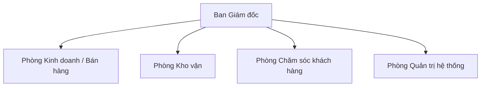
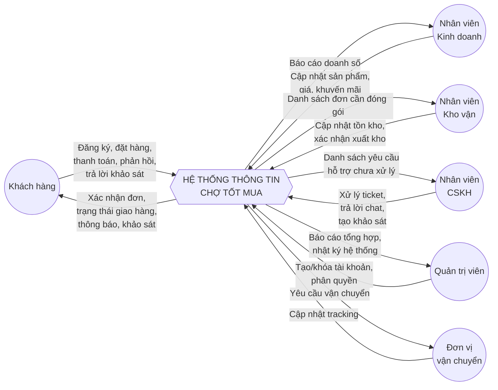
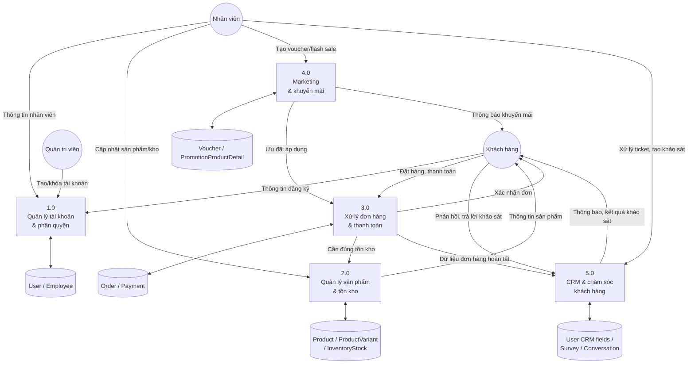

# Phần I — Báo cáo phân tích Hệ thống thông tin doanh nghiệp

> Áp dụng cho: Công ty TNHH Thương mại Chợ Tốt Mua
> Tài liệu này tương ứng đúng Phần I (40 điểm) trong bảng yêu cầu đồ án môn Hệ thống thông tin doanh nghiệp. Cơ cấu tổ chức, quy trình và các phòng ban mô tả bên dưới khớp trực tiếp với `crm-ecommerce-class-diagram.md` (đặc biệt là `Employee.department`) để đảm bảo phân tích và thiết kế nhất quán.

---

## 1. Giới thiệu về doanh nghiệp

**Tên doanh nghiệp:** Công ty TNHH Thương mại Chợ Tốt Mua
**Lĩnh vực hoạt động:** Bán lẻ trực tuyến đa ngành hàng (điện tử - điện máy, thời trang, mỹ phẩm, đồ gia dụng, mẹ & bé...)
**Mô hình kinh doanh:** Doanh nghiệp bán lẻ trực tiếp — công ty tự nhập hàng, tự quản lý kho, tự bán cho người tiêu dùng cuối qua kênh online (không phải sàn trung gian cho bên thứ ba ký gửi bán hàng).
**Năm thành lập:** 2023
**Quy mô nhân sự:** ~50 nhân viên
**Địa điểm:** Trụ sở chính tại TP. Hồ Chí Minh, 2 kho hàng tại TP. Hồ Chí Minh và Hà Nội

### Cơ cấu tổ chức

| Phòng ban | Vai trò chính | Tương ứng `Employee.department` |
|---|---|---|
| Ban Giám đốc | Điều hành chung, phê duyệt chính sách giá/khuyến mãi | `admin` |
| Phòng Kinh doanh / Bán hàng | Đăng bán sản phẩm, cập nhật giá, theo dõi doanh số | `sales` |
| Phòng Kho vận | Nhập/xuất kho, đóng gói, giao hàng | `warehouse` |
| Phòng Chăm sóc khách hàng | Tiếp nhận phản hồi, xử lý khiếu nại, chat/hotline | `cs` |
| Phòng Quản trị hệ thống | Vận hành hệ thống, phân quyền tài khoản | `admin` |

### Hoạt động hiện tại (trước khi có hệ thống mới)

- Bán hàng chủ yếu qua fanpage Facebook và Zalo OA, khách nhắn tin đặt hàng thủ công.
- Đơn hàng được nhân viên kinh doanh ghi vào **file Excel dùng chung**, dễ trùng lặp/sai sót khi nhiều người cùng sửa.
- Tồn kho được kiểm đếm thủ công theo tuần, thường xuyên lệch số liệu thực tế.
- Chăm sóc khách hàng sau bán chưa có quy trình rõ ràng — phản hồi khách hàng nằm rải rác trên nhiều kênh (tin nhắn Facebook, Zalo, điện thoại), không có nơi tổng hợp.
- Không có dữ liệu tổng hợp về khách hàng (không biết khách mua bao nhiêu lần, thích ngành hàng nào) nên không thể chạy khuyến mãi/marketing đúng đối tượng.

Đây chính là động lực để công ty đầu tư xây dựng hệ thống thông tin quản lý bán hàng + CRM tập trung.

---

## 2. Khảo sát hiện trạng Hệ thống thông tin doanh nghiệp

### 2.1 Mục đích khảo sát

Thu thập thông tin về cách thức vận hành hiện tại của công ty, xác định điểm nghẽn trong quy trình bán hàng — chăm sóc khách hàng, làm cơ sở thiết kế hệ thống mới.

### 2.2 Đối tượng khảo sát

Ban Giám đốc, trưởng phòng Kinh doanh, trưởng phòng Kho vận, trưởng phòng CSKH — tổng cộng 4 người được phỏng vấn trực tiếp kết hợp bảng câu hỏi.

### 2.3 Bảng câu hỏi khảo sát

| # | Câu hỏi | Ghi chú thu thập |
|---|---|---|
| 1 | Công ty hiện đang bán hàng qua những kênh nào? | Facebook, Zalo, chưa có website/app riêng |
| 2 | Đơn hàng hiện được ghi nhận và lưu trữ ở đâu? | File Excel dùng chung qua Google Sheets |
| 3 | Trung bình mỗi ngày công ty xử lý bao nhiêu đơn hàng? | ~80-120 đơn/ngày |
| 4 | Ai là người chịu trách nhiệm nhập đơn hàng vào hệ thống? | Nhân viên kinh doanh, không phân quyền rõ ràng |
| 5 | Có bao giờ xảy ra tình trạng 2 người cùng sửa 1 đơn hàng gây sai lệch không? | Có, trung bình 3-5 lần/tuần |
| 6 | Việc kiểm kê tồn kho được thực hiện như thế nào và tần suất? | Kiểm đếm thủ công, 1 lần/tuần |
| 7 | Có từng xảy ra tình trạng bán hàng nhưng hết hàng trong kho không? | Có, khoảng 10-15 lần/tháng |
| 8 | Công ty có quản lý nhiều kho hàng ở nhiều địa điểm không? | Có, 2 kho (TP.HCM, Hà Nội) |
| 9 | Khách hàng phản hồi/khiếu nại qua những kênh nào? | Facebook, Zalo, điện thoại — không tổng hợp |
| 10 | Thời gian trung bình để phản hồi 1 yêu cầu của khách hàng là bao lâu? | 4-8 giờ, có lúc bỏ sót |
| 11 | Công ty có đang thực hiện chương trình khuyến mãi/voucher không? Quản lý ra sao? | Có, quản lý thủ công bằng mã giảm giá viết tay |
| 12 | Công ty có dữ liệu về khách hàng thân thiết (mua nhiều lần) không? | Không có hệ thống, chỉ nhớ mặt/tên khách quen |
| 13 | Công ty có từng thực hiện khảo sát ý kiến khách hàng chưa? | Chưa từng thực hiện bài bản |
| 14 | Nhân viên có được phân quyền truy cập dữ liệu theo vai trò không? | Chưa, mọi người dùng chung 1 tài khoản Google Sheets |
| 15 | Công ty có kế hoạch mở rộng quy mô trong 1-2 năm tới không? | Có, dự kiến tăng gấp đôi đơn hàng |
| 16 | Ngân sách và thời gian dự kiến để triển khai hệ thống mới? | ~3-6 tháng, ngân sách vừa phải cho giai đoạn đầu |
| 17 | Yêu cầu bắt buộc nào công ty muốn có ở hệ thống mới? | Tách quyền quản trị viên riêng biệt theo phòng ban, có báo cáo khách hàng, có khảo sát khách hàng |

### 2.4 Tổng kết kết quả khảo sát

1. **Quy trình xử lý đơn hàng phân mảnh, dễ sai sót**: dùng file Excel dùng chung là điểm nghẽn lớn nhất — không có khoá dữ liệu, không có lịch sử thay đổi trạng thái đơn hàng rõ ràng. → Cần một hệ thống `Order`/`OrderStatusHistory` tập trung, có audit trail.
2. **Tồn kho không đồng bộ theo thời gian thực**: kiểm kê thủ công theo tuần dẫn đến bán vượt tồn kho. → Cần `InventoryStock`/`InventoryMovement` cập nhật theo từng giao dịch.
3. **Chăm sóc khách hàng thiếu kênh tổng hợp**: phản hồi rải rác nhiều nơi, phản hồi chậm. → Cần `Conversation` tập trung (hỗ trợ cả ticket lẫn chat).
4. **Thiếu dữ liệu khách hàng để làm marketing đúng đối tượng**: không có phân khúc khách hàng, không khảo sát được thị hiếu. → Cần `User` (field CRM: `ltv`/`totalOrders`/`rfmSegment`)/`CustomerSegment`/`Survey`.
5. **Không phân quyền theo vai trò**: rủi ro bảo mật và khó quy trách nhiệm khi có sai sót. → Cần `Employee.department` + phân quyền theo vai trò, giao diện Admin tách biệt.

**Kết luận:** kết quả khảo sát khẳng định nhu cầu xây dựng một hệ thống thông tin tập trung, có phân quyền theo phòng ban, quản lý đơn hàng — tồn kho theo thời gian thực, và có module CRM để khai thác dữ liệu khách hàng — đúng như phạm vi đã thiết kế trong `crm-ecommerce-class-diagram.md`.

---

## 3. Phân tích Hệ thống thông tin doanh nghiệp

### 3.1 Bài toán

Công ty Chợ Tốt Mua cần một hệ thống thông tin thay thế quy trình thủ công (Excel + mạng xã hội) hiện tại, đáp ứng đồng thời 3 nhóm nghiệp vụ:

1. **Bán hàng trực tuyến**: khách hàng tự duyệt sản phẩm, đặt hàng, thanh toán, theo dõi đơn hàng trên website/app mà không cần liên hệ trực tiếp nhân viên.
2. **Vận hành nội bộ**: nhân viên kinh doanh quản lý sản phẩm/giá, nhân viên kho quản lý tồn kho — xuất/nhập theo từng đơn hàng thực tế, quản trị viên phân quyền tài khoản theo phòng ban.
3. **Quản lý quan hệ khách hàng (CRM)**: tổng hợp lịch sử mua hàng, phân khúc khách hàng, chăm sóc sau bán (ticket, chat), khảo sát ý kiến khách hàng có hệ thống, báo cáo nhân khẩu học phục vụ ra quyết định marketing.

Hệ thống phải đảm bảo: dữ liệu tập trung (không còn file Excel dùng chung), có dấu vết audit (ai thay đổi gì, khi nào), và tách biệt rõ giao diện quản trị theo từng vai trò.

### 3.2 Sơ đồ chức năng (BFD)

```mermaid
graph TD
    HT["HỆ THỐNG THÔNG TIN<br/>CHỢ TỐT MUA"]

    HT --> QL[1. Quản lý Người dùng & Nhân sự]
    HT --> SP[2. Quản lý Sản phẩm & Kho]
    HT --> DH[3. Quản lý Đơn hàng & Thanh toán]
    HT --> MK[4. Marketing & Khuyến mãi]
    HT --> CRM[5. Chăm sóc Khách hàng & CRM]

    QL --> QL1[Đăng ký / Đăng nhập]
    QL --> QL2[Quản lý hồ sơ cá nhân]
    QL --> QL3[Quản lý nhân viên nội bộ]
    QL --> QL4[Phân quyền theo phòng ban]

    SP --> SP1[Quản lý danh mục / thương hiệu]
    SP --> SP2[Quản lý sản phẩm & biến thể]
    SP --> SP3[Quản lý kho hàng]
    SP --> SP4[Theo dõi nhập/xuất tồn kho]

    DH --> DH1[Giỏ hàng]
    DH --> DH2[Đặt hàng / Checkout]
    DH --> DH3[Thanh toán & Ví điện tử]
    DH --> DH4[Giao hàng & Vận chuyển]
    DH --> DH5[Đổi trả & Hoàn tiền]

    MK --> MK1[Voucher / Mã giảm giá]
    MK --> MK2[Flash Sale]
    MK --> MK3[Tích điểm thành viên]
    MK --> MK4[Đánh giá sản phẩm]

    CRM --> CRM1[Quản lý khách hàng<br/>thêm/khóa/xóa mềm]
    CRM --> CRM2[Phân khúc khách hàng]
    CRM --> CRM3[Chiến dịch & Thông báo]
    CRM --> CRM4[Hỗ trợ / Ticket / Chat]
    CRM --> CRM5[Khảo sát khách hàng]
    CRM --> CRM6[Báo cáo nhân khẩu học]
```

### 3.3 Sơ đồ ngữ cảnh (Context Diagram)

### 3.4 Sơ đồ luồng dữ liệu mức đỉnh (DFD Level 0)

---

## 4. Thiết kế Hệ thống thông tin

### 4.1 Thiết kế CSDL

Lược đồ tổng quan (ERD ở dạng class diagram, đã bao gồm khoá chính/khoá ngoại và cardinality từng quan hệ) xem tại `crm-ecommerce-class-diagram.md`. Mục này trình bày **bảng mô tả chi tiết từng bảng và thuộc tính**, chuyển trực tiếp từ class diagram sang lược đồ quan hệ — mỗi `class` là 1 bảng, mỗi thuộc tính là 1 cột, kiểu dữ liệu quy đổi theo bảng sau:

| Kiểu trong class diagram | Kiểu dữ liệu CSDL (PostgreSQL) |
|---|---|
| UUID | `UUID` |
| String | `VARCHAR` |
| Text | `TEXT` |
| Int | `INTEGER` |
| Decimal | `DECIMAL(12,2)` |
| Boolean | `BOOLEAN` |
| DateTime | `TIMESTAMP` |
| Date | `DATE` |
| JSON | `JSONB` |

#### Domain A — Identity & Company

**User**
| Trường | Kiểu | Ràng buộc | Mô tả |
|---|---|---|---|
| id | UUID | PK | |
| role | VARCHAR | NOT NULL, mặc định `buyer` | `buyer` / `admin` |
| phone | VARCHAR | UNIQUE | |
| email | VARCHAR | UNIQUE | |
| password_hash | VARCHAR | NOT NULL | Mật khẩu đã băm (bcrypt) |
| status | VARCHAR | NOT NULL, mặc định `active` | `active` / `locked` / `deleted` (xóa mềm) |
| full_name | VARCHAR | | |
| avatar_url | VARCHAR | | |
| gender | VARCHAR | | Dùng cho báo cáo demographic |
| dob | DATE | | Dùng tính độ tuổi cho báo cáo demographic |
| created_at | TIMESTAMP | NOT NULL | |
| last_login_at | TIMESTAMP | | |

**Address**
| Trường | Kiểu | Ràng buộc | Mô tả |
|---|---|---|---|
| id | UUID | PK | |
| user_id | UUID | FK → User.id | |
| recipient_name | VARCHAR | NOT NULL | |
| phone | VARCHAR | NOT NULL | |
| full_address | VARCHAR | NOT NULL | |
| is_default | BOOLEAN | mặc định false | |

**Employee**
| Trường | Kiểu | Ràng buộc | Mô tả |
|---|---|---|---|
| id | UUID | PK | |
| user_id | UUID | FK → User.id, UNIQUE | Quan hệ 1-1 (0..1) với User |
| department | VARCHAR | NOT NULL | `sales` / `warehouse` / `admin` / `cs` |
| position | VARCHAR | | |
| hired_at | TIMESTAMP | | |

#### Domain B — Catalog & Inventory

**Category**
| Trường | Kiểu | Ràng buộc | Mô tả |
|---|---|---|---|
| id | UUID | PK | |
| parent_id | UUID | FK → Category.id, NULL | Tự quan hệ, cây phân cấp |
| name | VARCHAR | NOT NULL | |
| slug | VARCHAR | UNIQUE | |

**Product**
| Trường | Kiểu | Ràng buộc | Mô tả |
|---|---|---|---|
| id | UUID | PK | |
| category_id | UUID | FK → Category.id | |
| brand_name | VARCHAR | NULL | Tên hãng dạng chuỗi tự do — không tách bảng `Brand` riêng |
| name | VARCHAR | NOT NULL | |
| description | TEXT | | |
| status | VARCHAR | NOT NULL, mặc định `draft` | `draft` / `published` |
| product_type | VARCHAR | NOT NULL, mặc định `accessory` | `game_disc` / `controller` / `accessory` |
| platforms | JSONB | | Mảng nền tảng tương thích, vd `["PS5","PS4"]` |
| publisher | VARCHAR | NULL | Nhà phát hành — chỉ dùng khi `product_type = 'game_disc'` |
| genre | VARCHAR | NULL | Thể loại game — chỉ dùng khi `product_type = 'game_disc'` |
| age_rating | VARCHAR | NULL | Phân loại độ tuổi PEGI/ESRB — chỉ dùng khi `product_type = 'game_disc'` |
| release_date | DATE | NULL | Ngày phát hành game/đời tay cầm |
| connection_type | VARCHAR | NULL | `wired` / `wireless` / `bluetooth` — chỉ dùng khi `product_type` là `controller`/`accessory` |
| warranty_months | INTEGER | NULL | Số tháng bảo hành — chỉ dùng cho hàng phần cứng (`controller`/`accessory`) |
| image_urls | JSONB | | Mảng URL ảnh sản phẩm, thứ tự phần tử = thứ tự hiển thị — không tách bảng `ProductImage` riêng |

**ProductVariant**
| Trường | Kiểu | Ràng buộc | Mô tả |
|---|---|---|---|
| id | UUID | PK | |
| product_id | UUID | FK → Product.id | |
| sku | VARCHAR | UNIQUE | |
| attributes | JSONB | | vd `{"color":"đỏ","size":"L"}` |
| price | DECIMAL(12,2) | NOT NULL | |
| compare_price | DECIMAL(12,2) | | Giá gạch ngang khi giảm giá |
| image_url | VARCHAR | | |
| status | VARCHAR | NOT NULL, mặc định `active` | |

**Warehouse**
| Trường | Kiểu | Ràng buộc | Mô tả |
|---|---|---|---|
| id | UUID | PK | |
| name | VARCHAR | NOT NULL | |
| address | VARCHAR | | |

**InventoryStock**
| Trường | Kiểu | Ràng buộc | Mô tả |
|---|---|---|---|
| id | UUID | PK | |
| variant_id | UUID | FK → ProductVariant.id | |
| warehouse_id | UUID | FK → Warehouse.id | |
| quantity | INTEGER | mặc định 0 | Tồn kho thực tế |
| reserved_qty | INTEGER | mặc định 0 | Đã giữ chỗ cho đơn chưa xác nhận |

**GoodsReceipt**
| Trường | Kiểu | Ràng buộc | Mô tả |
|---|---|---|---|
| id | UUID | PK | |
| code | VARCHAR | UNIQUE | Mã phiếu nhập |
| employee_id | UUID | FK → Employee.id | Nhân viên lập phiếu |
| warehouse_id | UUID | FK → Warehouse.id | Kho nhập vào |
| supplier_name | VARCHAR | | |
| status | VARCHAR | NOT NULL, mặc định `pending` | `pending`/`approved`/`rejected` — chỉ cộng InventoryStock khi `approved` |
| received_at | TIMESTAMP | NOT NULL | |

**GoodsReceiptItem**
| Trường | Kiểu | Ràng buộc | Mô tả |
|---|---|---|---|
| id | UUID | PK | |
| receipt_id | UUID | FK → GoodsReceipt.id | |
| variant_id | UUID | FK → ProductVariant.id | |
| quantity | INTEGER | NOT NULL | |
| unit_cost | DECIMAL(12,2) | NOT NULL | Giá nhập (khác `price` là giá bán) |
| line_total | DECIMAL(12,2) | NOT NULL | = `quantity` × `unit_cost` |

**InventoryMovement**
| Trường | Kiểu | Ràng buộc | Mô tả |
|---|---|---|---|
| id | UUID | PK | |
| stock_id | UUID | FK → InventoryStock.id | |
| order_id | UUID | FK → Order.id, NULL | Có giá trị khi `type=export` (bán hàng) |
| goods_receipt_id | UUID | FK → GoodsReceipt.id, NULL | Có giá trị khi `type=import` (nhập kho) |
| type | VARCHAR | NOT NULL | `import` / `export` / `adjust` |
| quantity | INTEGER | NOT NULL | |
| occurred_at | TIMESTAMP | NOT NULL | |

#### Domain C — Cart → Order → Payment → Shipping

**CartItem**
| Trường | Kiểu | Ràng buộc | Mô tả |
|---|---|---|---|
| id | UUID | PK | |
| user_id | UUID | FK → User.id | Trỏ thẳng User, không qua bảng Cart trung gian |
| variant_id | UUID | FK → ProductVariant.id | |
| quantity | INTEGER | NOT NULL | |
| is_selected | BOOLEAN | mặc định true | Có chọn để đặt hàng lần này không |
| updated_at | TIMESTAMP | | |

**Order**
| Trường | Kiểu | Ràng buộc | Mô tả |
|---|---|---|---|
| id | UUID | PK | |
| user_id | UUID | FK → User.id | |
| employee_id | UUID | FK → Employee.id, NULL | Nhân viên xử lý/xuất hoá đơn — NULL nếu khách tự đặt online |
| address_id | UUID | FK → Address.id | |
| shipping_address_snapshot | VARCHAR | NOT NULL | Snapshot địa chỉ lúc đặt — tránh lịch sử đơn đổi hồi tố nếu Address bị sửa sau |
| subtotal_amount | DECIMAL(12,2) | NOT NULL | |
| discount_amount | DECIMAL(12,2) | mặc định 0 | |
| shipping_fee_amount | DECIMAL(12,2) | mặc định 0 | |
| total_amount | DECIMAL(12,2) | NOT NULL | |
| status | VARCHAR | NOT NULL, mặc định `pending` | `pending`/`confirmed`/`shipping`/`delivered`/`cancelled` |
| warehouse_id | UUID | FK → Warehouse.id, NULL | Kho xuất hàng — NULL cho tới khi xác nhận đóng gói |
| shipping_provider_name | VARCHAR | NULL | Tên đơn vị vận chuyển dạng chuỗi tự do — không tách bảng `ShippingProvider` riêng |
| tracking_no | VARCHAR | NULL | |
| shipment_status | VARCHAR | NOT NULL, mặc định `pending` | `pending`/`packed`/`shipping`/`delivered` — không tách bảng `Shipment` riêng |
| created_at | TIMESTAMP | NOT NULL | |

**OrderItem**
| Trường | Kiểu | Ràng buộc | Mô tả |
|---|---|---|---|
| id | UUID | PK | |
| order_id | UUID | FK → Order.id | |
| variant_id | UUID | FK → ProductVariant.id | |
| quantity | INTEGER | NOT NULL | |
| unit_price | DECIMAL(12,2) | NOT NULL | |
| line_total | DECIMAL(12,2) | NOT NULL | = `quantity` × `unit_price` — thành tiền cho dòng chi tiết hoá đơn |
| product_name_snapshot | VARCHAR | | Chống sai lệch khi sản phẩm đổi tên sau này |
| variant_attributes_snapshot | JSONB | | |

**OrderStatusHistory**
| Trường | Kiểu | Ràng buộc | Mô tả |
|---|---|---|---|
| id | UUID | PK | |
| order_id | UUID | FK → Order.id | |
| status | VARCHAR | NOT NULL | |
| changed_by | UUID | FK → User.id, NULL | |
| changed_by_type | VARCHAR | | `buyer`/`employee`/`system` |
| reason | VARCHAR | | |
| changed_at | TIMESTAMP | NOT NULL | |

**Payment**
| Trường | Kiểu | Ràng buộc | Mô tả |
|---|---|---|---|
| id | UUID | PK | |
| order_id | UUID | FK → Order.id, NULL | NULL nếu là nạp ví |
| user_id | UUID | FK → User.id, NULL | NULL nếu là thanh toán đơn — trỏ thẳng User, không qua bảng Wallet |
| wallet_transaction_id | UUID | FK → WalletTransaction.id, NULL | WalletTransaction được tạo khi nạp ví thành công |
| purpose | VARCHAR | NOT NULL | `checkout` / `wallet_topup` |
| method | VARCHAR | | `cod`/`bank_transfer`/`wallet` |
| amount | DECIMAL(12,2) | NOT NULL | |
| status | VARCHAR | NOT NULL, mặc định `pending` | |
| paid_at | TIMESTAMP | | |

**WalletTransaction**
| Trường | Kiểu | Ràng buộc | Mô tả |
|---|---|---|---|
| id | UUID | PK | |
| user_id | UUID | FK → User.id | Trỏ thẳng User — không tách bảng `Wallet` riêng, số dư nằm ở `User.wallet_balance` |
| order_id | UUID | FK → Order.id, NULL | Có giá trị khi `type=payment` (trả đơn bằng ví) hoặc `refund` |
| type | VARCHAR | NOT NULL | `topup`/`refund`/`payment` |
| amount | DECIMAL(12,2) | NOT NULL | |
| created_at | TIMESTAMP | NOT NULL | |

**RefundReturn**
| Trường | Kiểu | Ràng buộc | Mô tả |
|---|---|---|---|
| id | UUID | PK | |
| order_item_id | UUID | FK → OrderItem.id | |
| employee_id | UUID | FK → Employee.id, NULL | Nhân viên CSKH duyệt/từ chối — NULL cho tới khi xử lý |
| wallet_transaction_id | UUID | FK → WalletTransaction.id, NULL | |
| reason | VARCHAR | | |
| status | VARCHAR | NOT NULL, mặc định `requested` | `requested`/`approved`/`rejected`/`refunded` |
| refund_amount | DECIMAL(12,2) | | |
| requested_at | TIMESTAMP | NOT NULL | |

#### Domain D — Marketing & Loyalty

**PromotionProgram**
| Trường | Kiểu | Ràng buộc | Mô tả |
|---|---|---|---|
| id | UUID | PK | |
| code | VARCHAR | UNIQUE | |
| name | VARCHAR | NOT NULL | |
| program_type | VARCHAR | NOT NULL | Nhãn phân loại chương trình cho báo cáo/lọc |
| target_loyalty_tier | VARCHAR | NULL | NULL = áp dụng mọi hạng; khớp giá trị với `User.loyalty_tier` |
| start_at | TIMESTAMP | NOT NULL | |
| end_at | TIMESTAMP | NOT NULL | |

**PromotionProductDetail**
| Trường | Kiểu | Ràng buộc | Mô tả |
|---|---|---|---|
| id | UUID | PK | |
| promotion_program_id | UUID | FK → PromotionProgram.id | |
| variant_id | UUID | FK → ProductVariant.id | |
| discount_percent | DECIMAL(5,2) | NULL | Cơ chế 1: giảm % — chọn 1 trong 2 cơ chế |
| flash_price | DECIMAL(12,2) | NULL | Cơ chế 2: giá sốc cố định (gộp chức năng FlashSale) |
| limit_qty | INTEGER | NULL | Chỉ dùng khi có `flash_price` |
| sold_qty | INTEGER | mặc định 0 | Chỉ dùng khi có `flash_price` |

**PromotionInvoiceDetail**
| Trường | Kiểu | Ràng buộc | Mô tả |
|---|---|---|---|
| id | UUID | PK | |
| promotion_program_id | UUID | FK → PromotionProgram.id | |
| discount_amount | DECIMAL(12,2) | NULL | Số tiền giảm cố định trên tổng hoá đơn — chọn 1 trong 2 |
| discount_percent | DECIMAL(5,2) | NULL | % giảm trên tổng hoá đơn |

**Voucher**
| Trường | Kiểu | Ràng buộc | Mô tả |
|---|---|---|---|
| id | UUID | PK | |
| promotion_program_id | UUID | FK → PromotionProgram.id | Mỗi voucher phụ thuộc đúng 1 chương trình khuyến mãi |
| code | VARCHAR | UNIQUE | |
| type | VARCHAR | NOT NULL | `percentage`/`fixed_amount` |
| value | DECIMAL(12,2) | NOT NULL | |
| expires_at | TIMESTAMP | | |

**VoucherUsage**
| Trường | Kiểu | Ràng buộc | Mô tả |
|---|---|---|---|
| id | UUID | PK | |
| voucher_id | UUID | FK → Voucher.id | |
| user_id | UUID | FK → User.id | |
| order_id | UUID | FK → Order.id | |
| used_at | TIMESTAMP | NOT NULL | |

**PromotionProductApplication**
| Trường | Kiểu | Ràng buộc | Mô tả |
|---|---|---|---|
| id | UUID | PK | |
| order_item_id | UUID | FK → OrderItem.id | |
| promotion_product_detail_id | UUID | FK → PromotionProductDetail.id | |
| discount_amount | DECIMAL(12,2) | NOT NULL | Số tiền thực giảm cho dòng đơn này — audit trail khuyến mãi tự động |
| applied_at | TIMESTAMP | NOT NULL | |

**PromotionInvoiceApplication**
| Trường | Kiểu | Ràng buộc | Mô tả |
|---|---|---|---|
| id | UUID | PK | |
| order_id | UUID | FK → Order.id | |
| promotion_invoice_detail_id | UUID | FK → PromotionInvoiceDetail.id | |
| discount_amount | DECIMAL(12,2) | NOT NULL | Số tiền thực giảm cho cả hoá đơn — audit trail khuyến mãi tự động |
| applied_at | TIMESTAMP | NOT NULL | |

**LoyaltyTransaction**
| Trường | Kiểu | Ràng buộc | Mô tả |
|---|---|---|---|
| id | UUID | PK | |
| user_id | UUID | FK → User.id | Điểm/hạng thành viên hiện tại nằm ở `User.loyalty_balance`/`loyalty_tier` |
| order_id | UUID | FK → Order.id, NULL | |
| points | INTEGER | NOT NULL | |
| reason | VARCHAR | | |
| created_at | TIMESTAMP | NOT NULL | |

**Review**
| Trường | Kiểu | Ràng buộc | Mô tả |
|---|---|---|---|
| id | UUID | PK | |
| user_id | UUID | FK → User.id | |
| order_item_id | UUID | FK → OrderItem.id, UNIQUE | Bắt buộc — chỉ review khi đã mua |
| rating | INTEGER | 1-5 | |
| comment | TEXT | | |
| employee_reply_id | UUID | FK → Employee.id, NULL | Nhân viên CSKH phản hồi — NULL = chưa phản hồi, không tách bảng `ReviewReply` riêng |
| reply_text | TEXT | NULL | |
| created_at | TIMESTAMP | NOT NULL | |

#### Domain E — CRM & Customer Care

> Các chỉ số CRM (`ltv`, `total_orders`, `last_purchase_at`, `rfm_segment`) đã gộp thẳng vào `User` từ v13 (quan hệ 1-1 bắt buộc) — không tách bảng `CustomerProfileCRM` riêng. Xem bảng `User` ở Domain A.

**CustomerSegment**
| Trường | Kiểu | Ràng buộc | Mô tả |
|---|---|---|---|
| id | UUID | PK | |
| name | VARCHAR | NOT NULL | |
| rule_definition | JSONB | | Điều kiện lọc, vd `{"totalOrders": {">=": 5}}` |

**SegmentMember**
| Trường | Kiểu | Ràng buộc | Mô tả |
|---|---|---|---|
| segment_id | UUID | PK (phần 1), FK → CustomerSegment.id | |
| user_id | UUID | PK (phần 2), FK → User.id | |
| added_at | TIMESTAMP | NOT NULL | |

**Campaign**
| Trường | Kiểu | Ràng buộc | Mô tả |
|---|---|---|---|
| id | UUID | PK | |
| name | VARCHAR | NOT NULL | |
| channel | VARCHAR | | `email`/`push`/`sms` |
| start_at | TIMESTAMP | | |
| end_at | TIMESTAMP | | |

**CampaignTarget**
| Trường | Kiểu | Ràng buộc | Mô tả |
|---|---|---|---|
| campaign_id | UUID | PK (phần 1), FK → Campaign.id | |
| segment_id | UUID | PK (phần 2), FK → CustomerSegment.id | |

**AgentAssignment**
| Trường | Kiểu | Ràng buộc | Mô tả |
|---|---|---|---|
| id | UUID | PK | |
| conversation_id | UUID | FK → Conversation.id | |
| employee_id | UUID | FK → Employee.id | |
| is_current | BOOLEAN | mặc định true | Giữ lịch sử điều chuyển/escalate |
| assigned_at | TIMESTAMP | NOT NULL | |

**Conversation**
| Trường | Kiểu | Ràng buộc | Mô tả |
|---|---|---|---|
| id | UUID | PK | |
| user_id | UUID | FK → User.id | |
| order_id | UUID | FK → Order.id, NULL | |
| type | VARCHAR | NOT NULL | `ticket`/`chat` |
| channel | VARCHAR | | |
| status | VARCHAR | | `open`/`in_progress`/`closed` (chỉ dùng khi type=`ticket`) |
| priority | VARCHAR | | (chỉ dùng khi type=`ticket`) |
| last_message_at | TIMESTAMP | | |

**ConversationMessage**
| Trường | Kiểu | Ràng buộc | Mô tả |
|---|---|---|---|
| id | UUID | PK | |
| conversation_id | UUID | FK → Conversation.id | |
| sender_id | UUID | FK → User.id | Khách hoặc nhân viên (đều là User) |
| content | TEXT | NOT NULL | |
| sent_at | TIMESTAMP | NOT NULL | |

**Notification**
| Trường | Kiểu | Ràng buộc | Mô tả |
|---|---|---|---|
| id | UUID | PK | |
| user_id | UUID | FK → User.id | |
| reference_type | VARCHAR | | `order`/`ticket`/`campaign`/`survey`/`conversation` |
| reference_id | UUID | | Đa hình theo `reference_type` |
| channel | VARCHAR | | |
| content | VARCHAR | | |
| status | VARCHAR | | `sent`/`read` |
| sent_at | TIMESTAMP | NOT NULL | |

**Survey**
| Trường | Kiểu | Ràng buộc | Mô tả |
|---|---|---|---|
| id | UUID | PK | |
| created_by_employee_id | UUID | FK → Employee.id | |
| title | VARCHAR | NOT NULL | |
| description | TEXT | | |
| status | VARCHAR | | `draft`/`sent`/`closed` |
| created_at | TIMESTAMP | NOT NULL | |

**SurveyQuestion**
| Trường | Kiểu | Ràng buộc | Mô tả |
|---|---|---|---|
| id | UUID | PK | |
| survey_id | UUID | FK → Survey.id | |
| question_text | TEXT | NOT NULL | |
| answer_type | VARCHAR | | `text`/`rating`/`multiple_choice` |
| sort_order | INTEGER | | |

**SurveyResponse**
| Trường | Kiểu | Ràng buộc | Mô tả |
|---|---|---|---|
| id | UUID | PK | |
| survey_id | UUID | FK → Survey.id | |
| user_id | UUID | FK → User.id | |
| order_id | UUID | FK → Order.id, NULL | Dùng cho khảo sát NPS gắn với 1 đơn hàng cụ thể |
| submitted_at | TIMESTAMP | NOT NULL | |

**SurveyAnswer**
| Trường | Kiểu | Ràng buộc | Mô tả |
|---|---|---|---|
| id | UUID | PK | |
| response_id | UUID | FK → SurveyResponse.id | |
| question_id | UUID | FK → SurveyQuestion.id | |
| answer_text | TEXT | | |

**Tổng cộng: 39 bảng** trên 5 domain nghiệp vụ.

### 4.2 Thiết kế giao diện

> Mục này sẽ được hoàn thiện với ảnh chụp màn hình thật sau khi hoàn thành cài đặt (Phase 1-6 trong kế hoạch triển khai) — hiện tại web mới chỉ có trang kiểm tra kết nối backend (Phase 0), chưa có giao diện nghiệp vụ để chụp minh hoạ chính thức cho báo cáo.

Bản mockup UI tham khảo (thiết kế trước, sẽ chuyển thành giao diện thật):
- Web: `index.html`/`styles.css`/`script.js` — trang chủ, danh mục, flash sale, giỏ hàng
- Mobile: `mobile_app/` (Flutter) — đầy đủ luồng trang chủ → chi tiết sản phẩm → giỏ hàng → giỏ hàng → hỗ trợ/tin nhắn, đã điều hướng được giữa các màn hình

---

## 5. Cài đặt, bảo trì & tổng kết

> Mục 4 (Cài đặt & bảo trì HTTT, hướng dẫn sử dụng) và Mục 5 (Tổng kết & hướng phát triển) trong bảng yêu cầu đồ án cần được viết **sau khi hoàn thành cài đặt hệ thống** (Phase 1-6) để nội dung phản ánh đúng hệ thống thật, tránh mô tả sai lệch với sản phẩm bàn giao. Sẽ bổ sung vào tài liệu này khi backend + web + mobile hoàn thiện.
