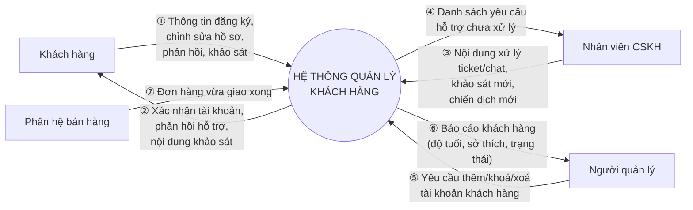
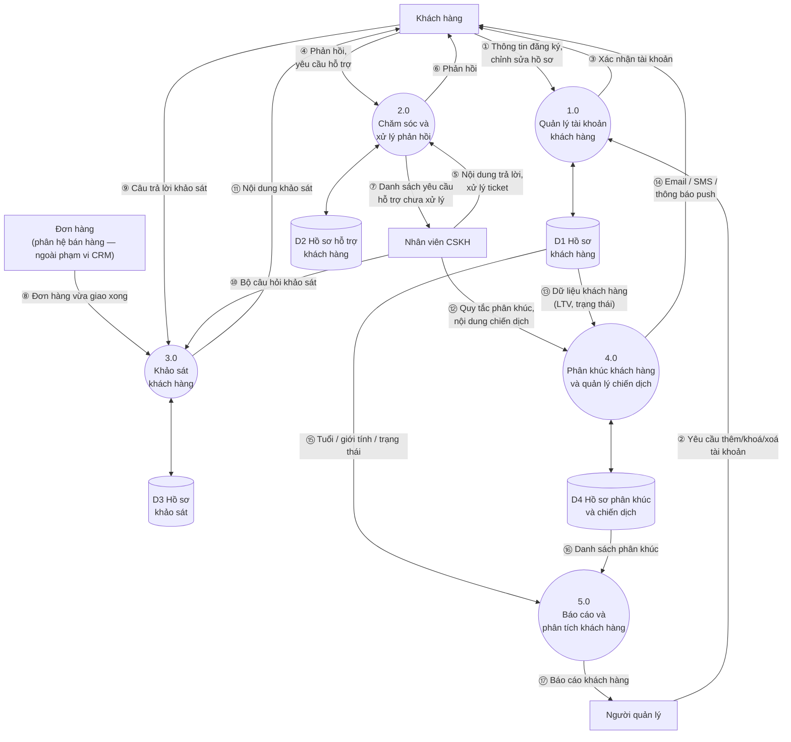
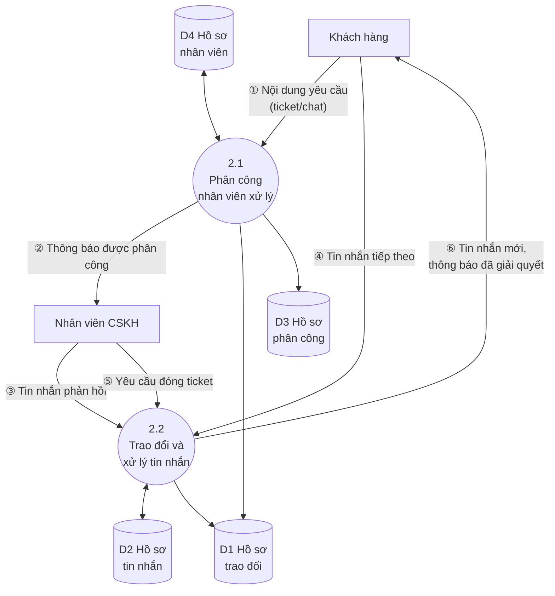
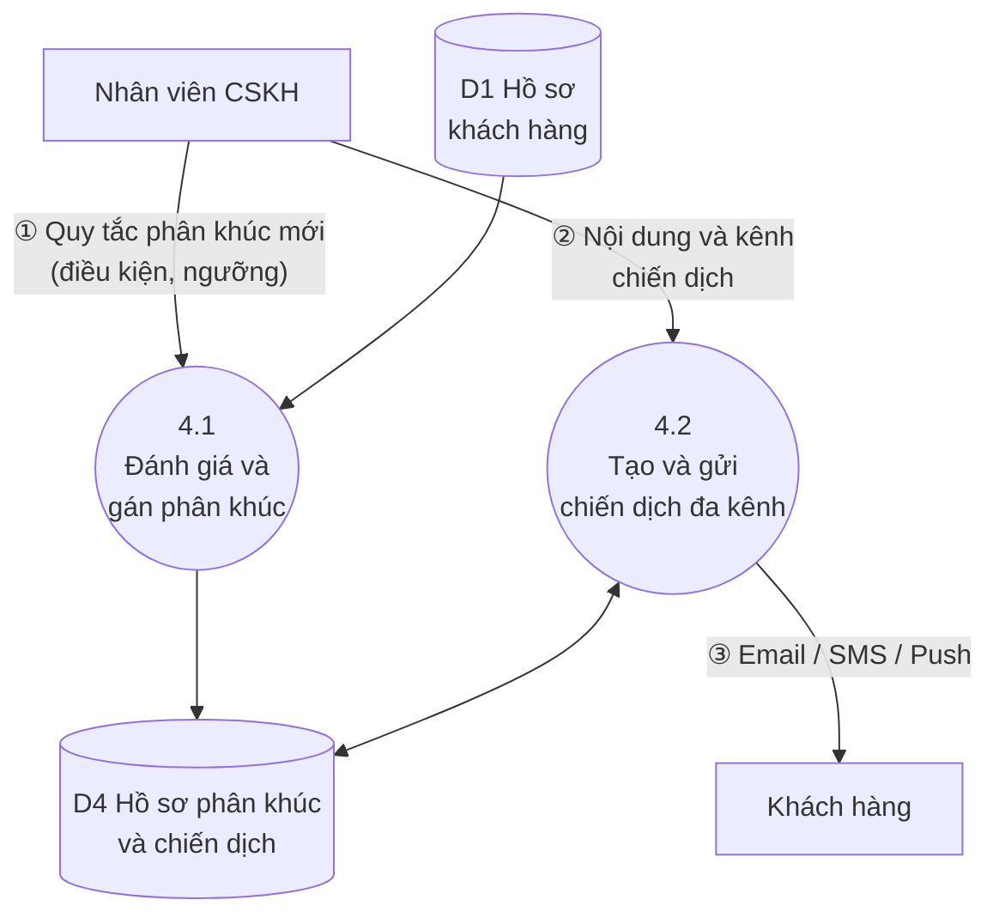

# Sơ đồ BFD & DFD — Phân hệ CRM (Chợ Tốt Mua)

> Tách riêng từ `docs/httttdn-phan1-baocao.md` (mục 3.2–3.5) để tiện nộp/trình bày độc lập.
> Khớp đúng mục **I.2 "Phân tích HTTT của DN"** trong rubric đồ án
> (`SGU-2026_2027-HK1-DO-AN-HTTTDN.docx`): *"Vẽ đầy đủ các sơ đồ: (2đ) sơ đồ chức năng,
> (2đ) sơ đồ ngữ cảnh, (4đ) luồng DL mức đỉnh"* — và khớp yêu cầu trên lớp của giảng viên
> (slide Tuần 4): **"1. Sơ đồ BFD — 2. Sơ đồ DFD (0,1,2)"**.
>
> **Phạm vi:** rubric mục III yêu cầu chọn **1 trong 3 phân hệ (HRM / CRM / MRP)** để cài
> đặt — nhóm chọn **CRM**. Toàn bộ sơ đồ dưới đây chỉ mô tả phân hệ CRM (quản lý tài khoản
> khách hàng, chăm sóc/phản hồi, khảo sát, phân khúc/chiến dịch, báo cáo khách hàng) —
> không mô tả lại các phân hệ nền tảng (bán hàng, kho, nhân sự nội bộ) đã nêu ở Phần II.
>
> Quy ước mức DFD dùng trong tài liệu này:
> - **Mức 0** = Sơ đồ ngữ cảnh (Context Diagram) — toàn phân hệ CRM là 1 tiến trình duy nhất.
> - **Mức 1** = Phân rã phân hệ CRM thành 5 tiến trình chính.
> - **Mức 2** = Phân rã tiếp tiến trình đặc trưng nhất (2.0 Chăm sóc và xử lý phản hồi)
>   thành các tiến trình con.
>
> Mỗi luồng dữ liệu được đánh số thứ tự (①②③...) theo đúng trình tự nghiệp vụ, giống cách
> đánh số trong ví dụ "DFD-0 của hệ thống đặt món ăn" của giáo trình.

---

## 1. Sơ đồ chức năng (BFD) — phân hệ CRM

```mermaid
graph TD
    HT["HỆ THỐNG QUẢN LÝ KHÁCH HÀNG<br/>Chợ Tốt Mua"]

    HT --> TK[1. Quản lý tài khoản khách hàng]
    HT --> CS[2. Chăm sóc và xử lý phản hồi]
    HT --> KS[3. Khảo sát khách hàng]
    HT --> PK[4. Phân khúc khách hàng<br/>và quản lý chiến dịch]
    HT --> BC[5. Báo cáo và phân tích khách hàng]

    TK --> TK1[Đăng ký / Đăng nhập]
    TK --> TK2[Chỉnh sửa hồ sơ cá nhân]
    TK --> TK3[Thêm khách hàng mới<br/>— nhân viên hỗ trợ qua điện thoại]
    TK --> TK4[Khoá / Xoá mềm tài khoản]

    CS --> CS1[Gửi phản hồi về sản phẩm<br/>— khách hàng]
    CS --> CS2[Tiếp nhận và xử lý phản hồi<br/>— nhân viên CSKH]
    CS --> CS3[Trao đổi qua Ticket / Chat]

    KS --> KS1[Tạo bảng khảo sát]
    KS --> KS2[Gửi khảo sát tới khách hàng]
    KS --> KS3[Khách hàng thực hiện khảo sát]
    KS --> KS4[Thống kê kết quả khảo sát]

    PK --> PK1[Phân khúc khách hàng]
    PK --> PK2[Tạo và gửi chiến dịch<br/>email / SMS / push]

    BC --> BC1[Báo cáo độ tuổi, giới tính]
    BC --> BC2[Báo cáo ngành hàng ưa thích]
    BC --> BC3[Báo cáo trạng thái tài khoản<br/>active / locked / deleted]
```

---

## 2. Sơ đồ DFD mức 0 (Sơ đồ ngữ cảnh / Context Diagram) — phân hệ CRM

---

## 3. Sơ đồ DFD mức 1 (phân rã phân hệ CRM thành 5 tiến trình chính)

---

## 4. Sơ đồ DFD mức 2 (phân rã các tiến trình phức tạp)

> DFD mức 2 phải phân rã **từng tiến trình mức 1 thực sự phức tạp thành một sơ đồ riêng** —
> không gộp chung vào một sơ đồ duy nhất. Trong 5 tiến trình mức 1 (1.0–5.0), chỉ có **2.0
> Chăm sóc và xử lý phản hồi** và **4.0 Phân khúc khách hàng và quản lý chiến dịch** có logic
> nghiệp vụ đủ phức tạp để cần phân rã thêm (1.0 và 3.0 phần lớn là CRUD/workflow đơn giản,
> 5.0 chỉ là truy vấn/tổng hợp dữ liệu nên không phân rã). Trong mỗi sơ đồ con, các bước
> thuần CRUD đơn giản (1 lệnh thêm/sửa/xoá, không có logic quyết định) không được vẽ thành
> tiến trình riêng mà gộp vào luồng dữ liệu vào/ra của tiến trình sở hữu chúng — chỉ tiến
> trình có logic quyết định thực sự (so khớp điều kiện, chọn lựa, tổng hợp nhiều nguồn) mới
> được tách thành ô riêng và đánh số.

### 4a. Phân rã tiến trình 2.0 — Chăm sóc và xử lý phản hồi

> Tách 2 chức năng phức tạp: **2.1 Phân công nhân viên xử lý** (phải chọn nhân viên phù hợp
> theo tải việc/kỹ năng — có logic quyết định) và **2.2 Trao đổi và xử lý tin nhắn** (xử lý
> hội thoại hai chiều, theo dõi trạng thái, xác định thời điểm đóng ticket). "Tạo yêu cầu"
> (1 lệnh thêm bản ghi) và "đóng ticket" (1 lệnh cập nhật trạng thái) gộp vào luồng vào/ra
> của 2.1/2.2 tương ứng, không vẽ thành ô riêng.

> Lưu ý: 4 kho dữ liệu D1–D4 giữ nguyên như trước (CRUD đọc/ghi các kho này không cần đánh
> số vì không phải luồng nghiệp vụ hai chiều với tác nhân) — chỉ gộp bớt số tiến trình, không
> gộp bớt kho dữ liệu, vì cả 4 kho đều vẫn thực sự được dùng.

### 4b. Phân rã tiến trình 4.0 — Phân khúc khách hàng và quản lý chiến dịch

> Tách 2 chức năng phức tạp: **4.1 Đánh giá và gán phân khúc** (so khớp dữ liệu hành vi/giá
> trị của từng khách hàng với điều kiện phân khúc do nhân viên thiết lập — có logic quyết
> định) và **4.2 Tạo và gửi chiến dịch đa kênh** (chọn danh sách mục tiêu, dựng nội dung,
> gửi qua nhiều kênh Email/SMS/Push — có logic điều phối nhiều nguồn). Đọc hồ sơ khách hàng
> (D1) để so khớp và ghi/đọc hồ sơ phân khúc (D4) đều là CRUD đơn giản, không đánh số.

