# Tổng quan luồng hoạt động hệ thống — Chợ Tốt Mua

> Tài liệu tổng quan dùng để trao đổi và chốt phương án triển khai trong nhóm.
> Nguồn sự thật chi tiết về dữ liệu vẫn là `crm-ecommerce-class-diagram.md`
> (class diagram) — tài liệu này chỉ tổng hợp lại ở mức **luồng hoạt động**
> (chức năng, tác nhân, dữ liệu, hành trình người dùng) để dễ nhìn toàn cảnh.

## 1. Giới thiệu hệ thống

**Chợ Tốt Mua** là hệ thống bán lẻ trực tuyến chuyên **tay cầm chơi game và đĩa game**, kết hợp module CRM (chăm sóc khách hàng) ngay trong cùng nền tảng — không phải sàn thương mại điện tử đa gian hàng, mà là hệ thống của **một doanh nghiệp bán lẻ duy nhất**.

Thành phần chính:
- **Web app** (React) — khách hàng mua sắm, trang quản trị (Admin) riêng biệt.
- **Mobile app** (Flutter) — khách hàng mua sắm trên di động.
- **Backend API** (Spring Boot) — xử lý nghiệp vụ, kết nối CSDL.
- **CSDL** (PostgreSQL, 45 bảng, 5 domain nghiệp vụ).

## 2. Sơ đồ chức năng hệ thống

```mermaid
graph TD
    HT["HỆ THỐNG<br/>CHỢ TỐT MUA"]

    HT --> QL[1. Quản lý Người dùng & Nhân sự]
    HT --> SP[2. Quản lý Sản phẩm & Kho]
    HT --> DH[3. Quản lý Đơn hàng & Thanh toán]
    HT --> MK[4. Marketing & Khuyến mãi]
    HT --> CRM[5. Chăm sóc Khách hàng & CRM]

    QL --> QL1[Đăng ký / Đăng nhập]
    QL --> QL2[Quản lý hồ sơ cá nhân]
    QL --> QL3[Quản lý nhân viên nội bộ]
    QL --> QL4[Phân quyền theo phòng ban]

    SP --> SP1[Quản lý danh mục / thương hiệu]
    SP --> SP2[Quản lý sản phẩm & biến thể]
    SP --> SP3[Quản lý kho hàng]
    SP --> SP4[Theo dõi nhập/xuất tồn kho]

    DH --> DH1[Giỏ hàng]
    DH --> DH2[Đặt hàng / Checkout]
    DH --> DH3[Thanh toán & Ví điện tử]
    DH --> DH4[Giao hàng & Vận chuyển]
    DH --> DH5[Đổi trả & Hoàn tiền]

    MK --> MK1[Voucher / Mã giảm giá]
    MK --> MK2[Flash Sale]
    MK --> MK3[Tích điểm thành viên]
    MK --> MK4[Đánh giá sản phẩm]

    CRM --> CRM1[Quản lý khách hàng<br/>thêm/khóa/xóa mềm]
    CRM --> CRM2[Phân khúc khách hàng]
    CRM --> CRM3[Chiến dịch & Thông báo]
    CRM --> CRM4[Hỗ trợ / Ticket / Chat]
    CRM --> CRM5[Khảo sát khách hàng]
    CRM --> CRM6[Báo cáo nhân khẩu học]
```

## 3. Sơ đồ Use Case (actor ↔ chức năng)

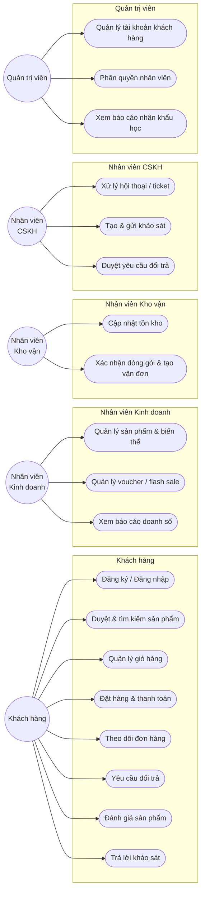

## 4. Sơ đồ ngữ cảnh (tác nhân & luồng thông tin)

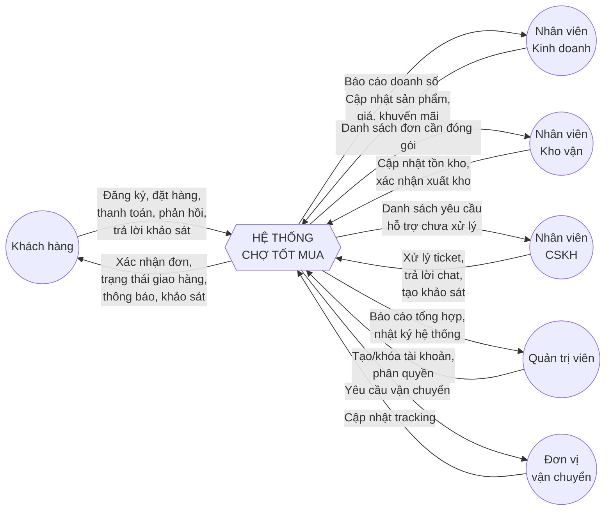

## 5. Sơ đồ luồng dữ liệu mức đỉnh

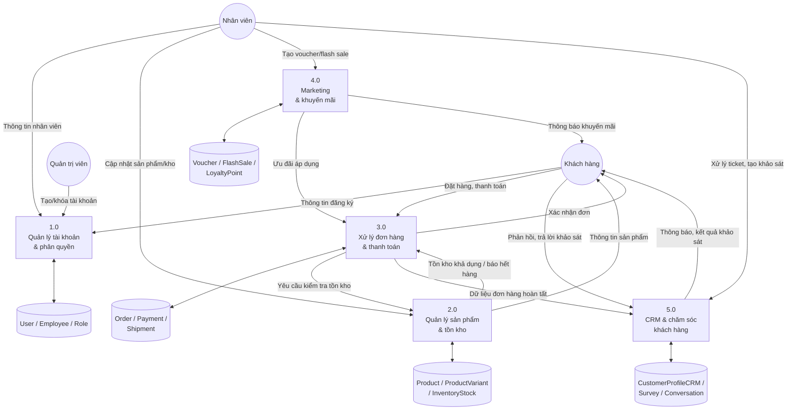

## 6. Sơ đồ trạng thái (vòng đời entity)

Order và User đều có quy tắc chuyển trạng thái một chiều (không quay ngược tuỳ ý) — quy tắc này chưa thể hiện được trong class diagram (chỉ là 1 field `status: String`), nên tách riêng thành state diagram.

**Order.status**

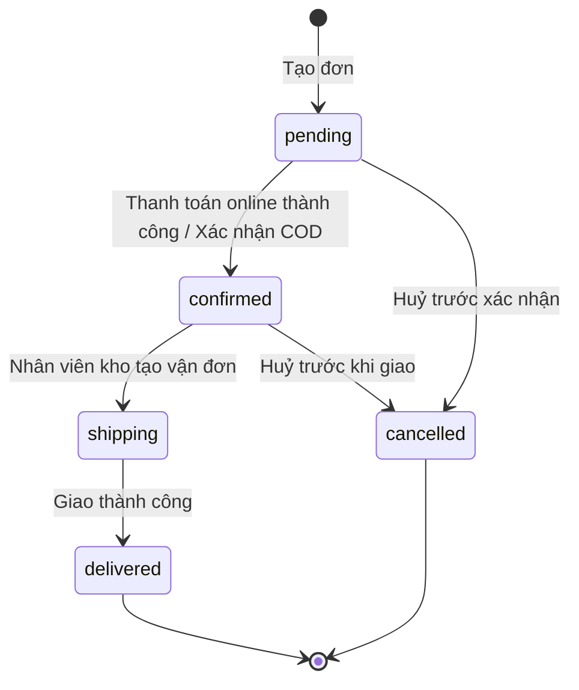

**User.status**

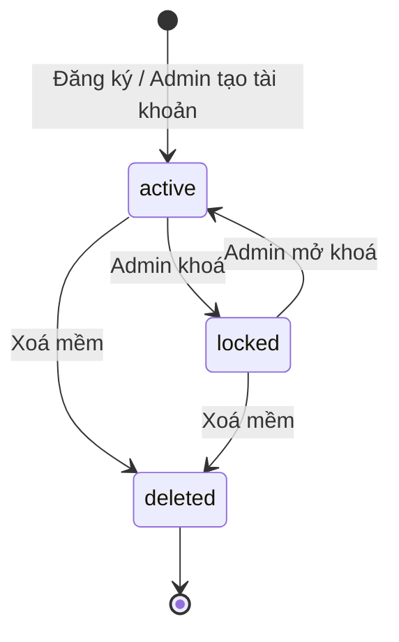

> Lưu ý: `deleted` là trạng thái cuối, không có chiều quay lại — đúng nguyên tắc xoá mềm (giữ dữ liệu, chỉ ẩn tài khoản).

## 7. Luồng người dùng — Khách hàng mua hàng (end-to-end)

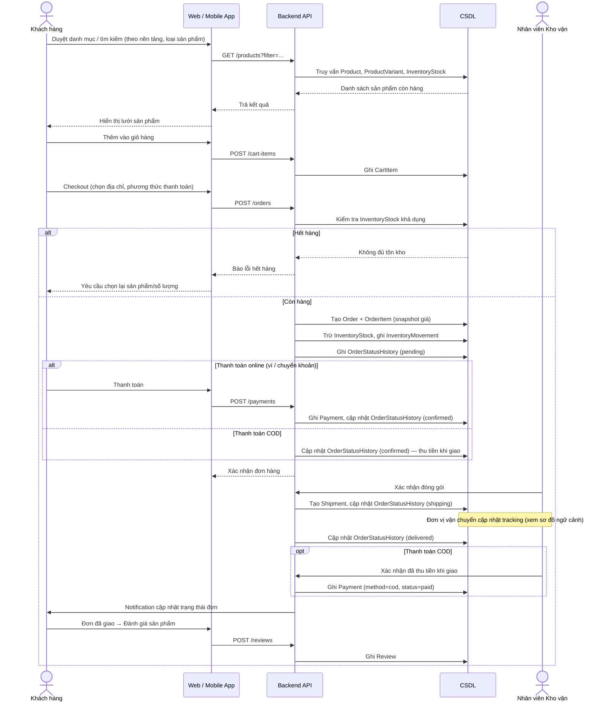

## 8. Luồng Đổi trả & Hoàn tiền

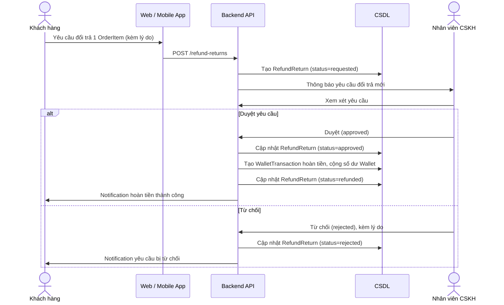

## 9. Luồng Khảo sát khách hàng (Survey)

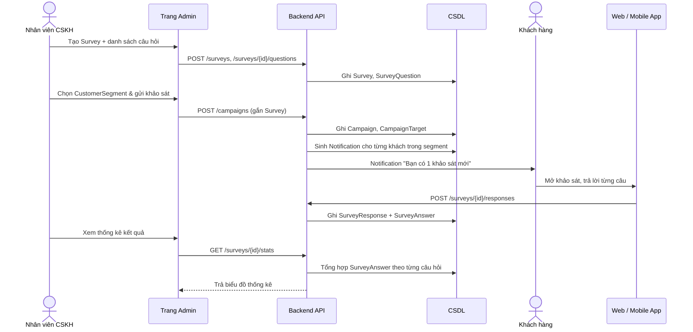

## 10. Luồng nhân viên / quản trị (theo phòng ban)

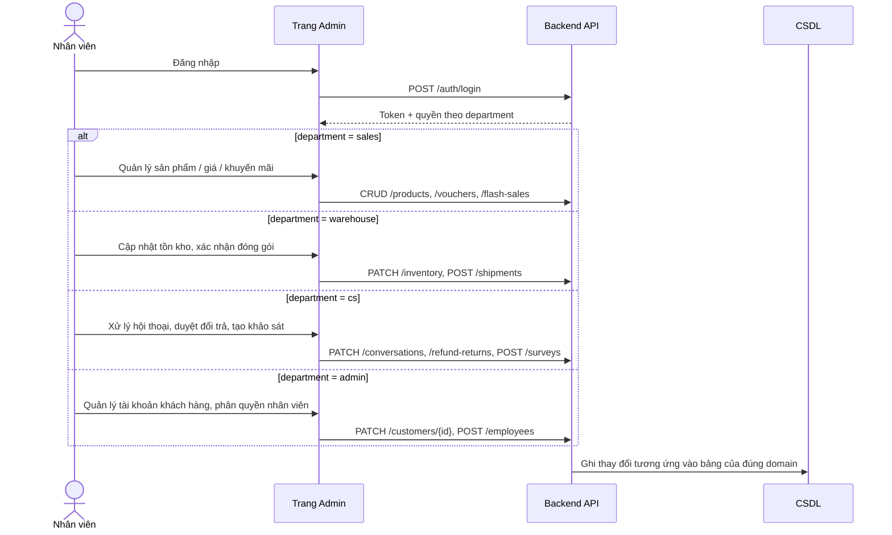

## 11. Kiến trúc kỹ thuật

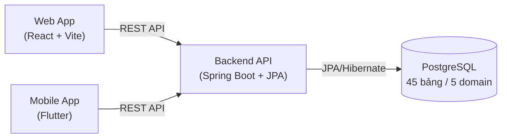

- **Backend**: Java Spring Boot, JPA/Hibernate, migration bằng Flyway.
- **Web**: React + Vite + React Router, không dùng UI framework ngoài — tự xây token màu/spacing riêng.
- **Mobile**: Flutter, dùng chung mô hình dữ liệu với web (đối chiếu qua `crm-ecommerce-class-diagram.md`).
- **CSDL**: PostgreSQL, container hoá bằng Docker Compose, có script backup/restore (`scripts/backup-db.sh`, `scripts/restore-db.sh`).

## 12. Trạng thái hiện tại (để nhóm đối chiếu trước khi chốt phương án)

| Phần | Trạng thái |
|---|---|
| Class diagram + migration CSDL (45 bảng) | ✅ Hoàn thành, đã verify chạy thật |
| Web — giao diện khách hàng (trang chủ, danh mục, tìm kiếm, giỏ hàng, đăng nhập) | ✅ Hoàn thành (dữ liệu mẫu, chưa nối API thật) |
| Web — giao diện Admin (sản phẩm, kho, đơn hàng, marketing, khách hàng, báo cáo, nhân viên) | ✅ Hoàn thành (dữ liệu mẫu, chưa nối API thật) |
| Mobile app — các màn hình chính | ✅ Hoàn thành (dữ liệu mẫu) |
| Backend API thật (Entity/Repository/Controller) | ❌ Chưa làm — mới có bộ khung project + `/health` |
| Kết nối Web/Mobile ↔ Backend thật | ❌ Chưa làm |
| Test tự động (unit/e2e) cho backend | ❌ Chưa làm |

**Việc cần bàn để chốt phương án**: thứ tự triển khai backend thật theo domain nào trước (đề xuất ban đầu: A→B→C→D→E theo đúng thứ tự phụ thuộc), có giữ nguyên phân công theo 5 domain hay không, và mốc thời gian cho từng domain.
